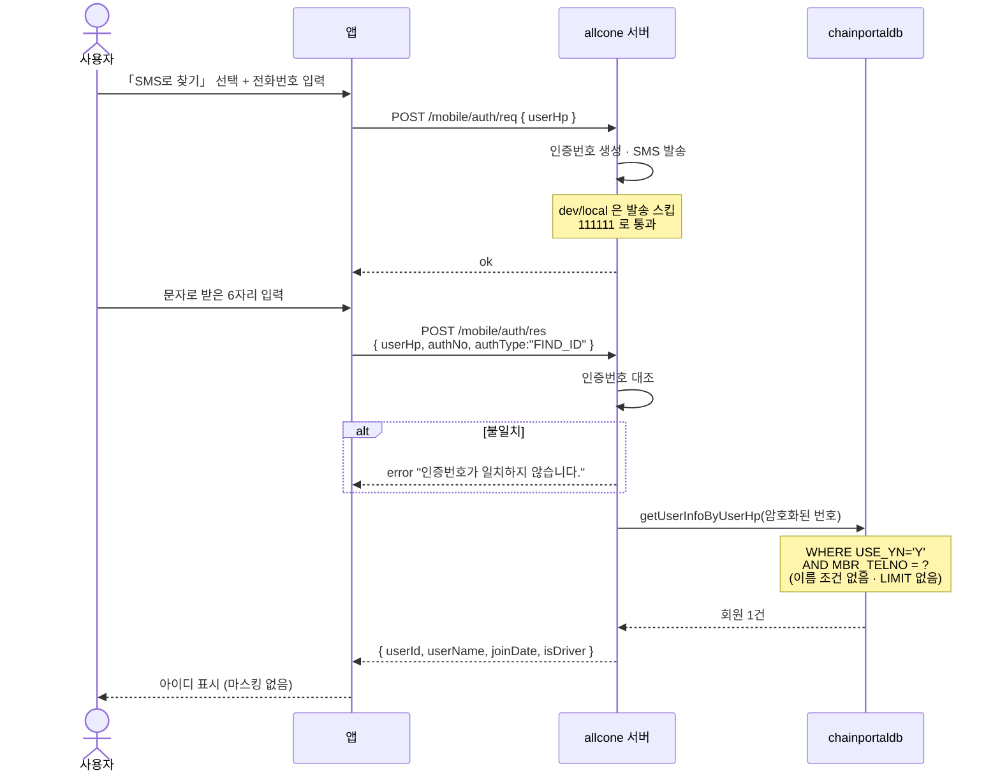
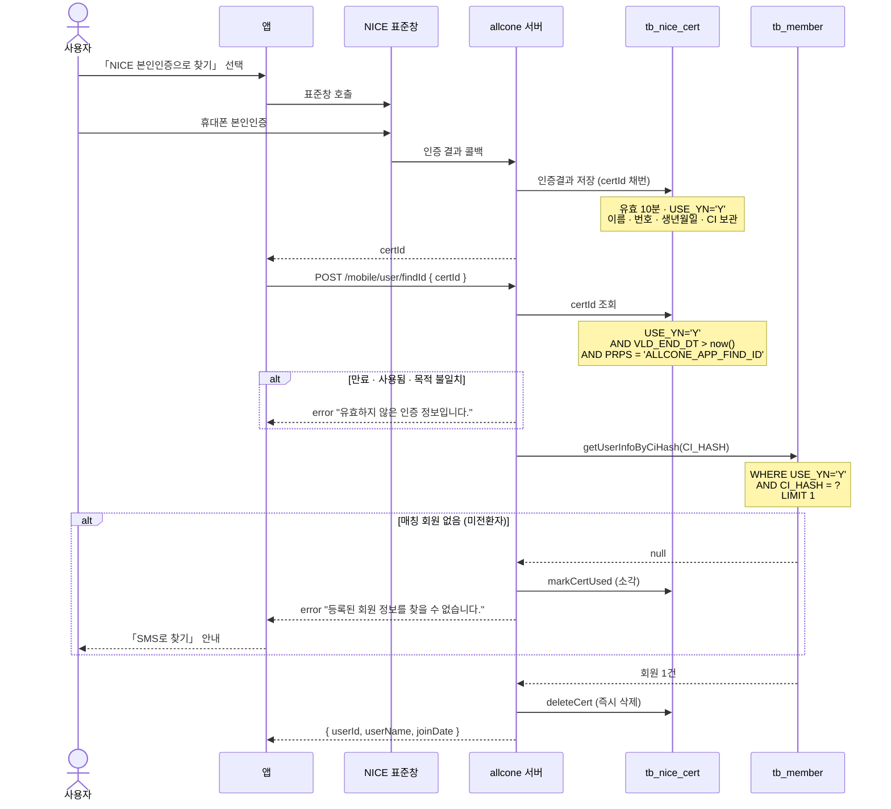
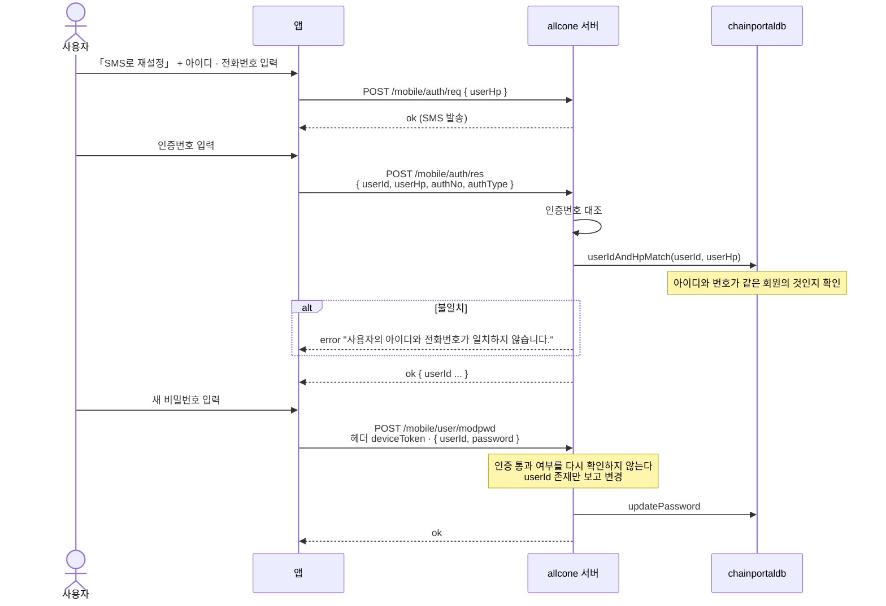
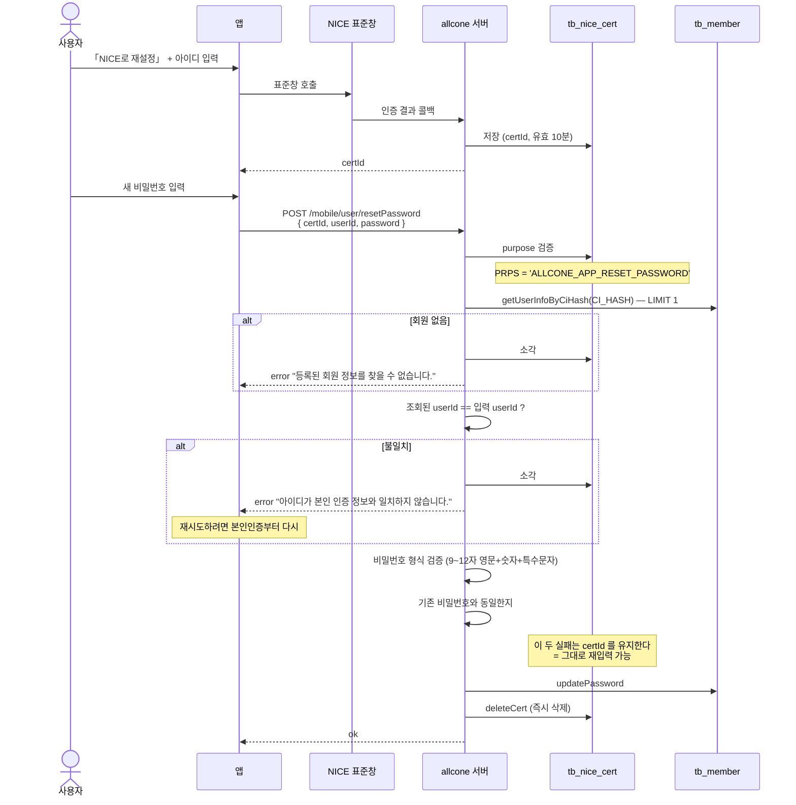

# 아이디찾기 · 비밀번호 재설정 — SMS / NICE 두 경로 정리

> 작성 2026-09-03 · 대상 독자: 백엔드 · 앱 개발자
> 기준 브랜치: `smartm2m/develop` (테스트베드 반영분)

NICE 본인인증이 들어오면서 **아이디찾기와 비밀번호 재설정이 각각 두 갈래**가 된다.
앱은 첫 화면에서 「SMS로 찾기」 / 「NICE 본인인증으로 찾기」 버튼으로 경로를 가른다.

두 경로는 **본인을 확인하는 방법도, 회원을 찾아내는 열쇠도 다르다.**

| | SMS 경로 | NICE 경로 |
|---|---|---|
| 본인확인 수단 | 문자로 받은 6자리 인증번호 | NICE 표준창 인증 결과 (`certId`) |
| 회원을 찾는 열쇠 | **전화번호** (`MBR_TELNO`) | **CI 해시** (`CI_HASH`) |
| 누가 쓸 수 있나 | 전원 | **NICE 인증을 이미 마친 회원만** |

한 줄로 요약하면 — **SMS는 "이 번호 쓰는 사람"을 찾고, NICE는 "이 사람"을 찾는다.**
번호는 바뀌거나 남과 겹칠 수 있지만 CI는 사람마다 고유하다. 대신 CI는 **한 번 인증해서 계정에 붙여둬야** 쓸 수 있다.

---

## 1. 아이디찾기 — SMS 경로

**핵심** — 서버는 **전화번호 하나로만** 조회한다. 앱에서 이름을 입력받아도 서버 조회 조건에 들어가지 않는다.

## 2. 아이디찾기 — NICE 경로

## 3. 비밀번호 재설정 — SMS 경로

**핵심** — 본인확인은 **2단계(`/auth/res`)에서 끝난다.** 3단계 `/modpwd`는 그 결과를 서버가 다시 확인하지 않는다. 앱이 순서대로 호출한다는 전제 위에 서 있다.

## 4. 비밀번호 재설정 — NICE 경로

---

## 값 흐름과 검증 — 표로

### 아이디찾기

| 단계 | 엔드포인트 | 보내는 값 | 서버가 하는 검증 | 조회 대상 · 조건 | 돌려주는 값 |
|---|---|---|---|---|---|
| SMS-1 | `POST /mobile/auth/req` | `userHp` | 없음 | — (SMS 발송) | ok |
| SMS-2 | `POST /mobile/auth/res` | `userHp` `authNo` `authType:FIND_ID` | 인증번호 대조 (`userId` 동봉 시 아이디-번호 일치까지) | `tb_member` + 권한 2테이블 INNER JOIN `USE_YN='Y' AND MBR_TELNO=?` 🔴 이름 조건 없음 · `LIMIT` 없음 | `userId` `userName` `userHp` `joinDate` `isDriver` |
| NICE-1 | NICE 표준창 → 콜백 | — | NICE 인증 | `tb_nice_cert` INSERT (유효 10분) | `certId` |
| NICE-2 | `POST /mobile/user/findId` | `certId` | `USE_YN='Y'` `VLD_END_DT > now()` `PRPS='ALLCONE_APP_FIND_ID'` | `tb_member` + 권한 2테이블 `USE_YN='Y' AND CI_HASH=?` 🔴 `LIMIT 1` | `userId` `userName` `joinDate` |

### 비밀번호 재설정

| 단계 | 엔드포인트 | 보내는 값 | 서버가 하는 검증 | 조회 대상 · 조건 | 돌려주는 값 |
|---|---|---|---|---|---|
| SMS-1 | `POST /mobile/auth/req` | `userHp` | 없음 | — | ok |
| SMS-2 | `POST /mobile/auth/res` | `userId` `userHp` `authNo` `authType` | 인증번호 대조 **`userIdAndHpMatch()`** | 아이디-번호 매칭 확인 | ok |
| SMS-3 | `POST /mobile/user/modpwd` | 헤더 `deviceToken` `userId` `password` | 🔴 **없음** — 회원 존재만 확인 | `getUserInfoByUserId` | ok |
| NICE-1 | NICE 표준창 → 콜백 | — | NICE 인증 | `tb_nice_cert` INSERT | `certId` |
| NICE-2 | `POST /mobile/user/resetPassword` | `certId` `userId` `password` | ① `PRPS='ALLCONE_APP_RESET_PASSWORD'` ② CI로 회원 조회 ③ **조회 `userId` == 입력 `userId`** ④ 비밀번호 형식 ⑤ 기존 비번과 동일 여부 | `tb_member` `USE_YN='Y' AND CI_HASH=?` 🔴 `LIMIT 1` | ok |

### `certId` 수명 — 실패해도 살아남는 경우가 갈린다

| 상황 | `certId` |
|---|---|
| 성공 | **즉시 삭제** (개인정보 보존 최소화) |
| CI 매칭 회원 없음 | **소각** (`USE_YN='N'`) |
| **아이디 불일치** | **소각** ← 재시도하려면 본인인증부터 다시 |
| 비밀번호 형식 오류 | **유지** — 그대로 재입력 가능 |
| 기존 비밀번호와 동일 | **유지** — 그대로 재입력 가능 |
| 10분 경과 | 만료. 매일 새벽 3시 배치가 정리 |

> NICE 규격의 `transaction_id` 유효시간이 10분이라 그에 맞춘 값이다.
> 24시간짜리는 NICE **access_token**(서버↔NICE 구간)이라 `certId`와 다르다.

---

## 엣지케이스

### 원인은 세 가지뿐이다

아래 사례가 많아 보이지만 뿌리는 셋이다.

| 원인 | 무엇이 문제인가 |
|---|---|
| **① `getUserInfoByUserHp`가 단건 조회** | `LIMIT`이 없는데 결과를 1건으로 받는다. 번호가 겹치면 예외가 난다 |
| **② `getUserInfoByCiHash`의 `LIMIT 1`** | 여러 건이어도 조용히 하나만 집는다. 어느 것이 나올지는 DB가 정한다 (정렬 기준 없음) |
| **③ CI 중복을 막는 장치가 없다** | 한 사람이 계정 여러 개에 각각 NICE 인증하면 같은 CI가 여러 계정에 붙는다 |

### 아이디찾기

| # | 케이스 | 어떻게 되나 | 심각도 |
|---|---|---|:--:|
| **A1** | **SMS · 번호가 여러 계정에 걸림** | `TooManyResultsException` → **HTTP 500**. `resultMessage`도 없이 실패 | 🔴 최상 |
| A2 | SMS · 이름+번호까지 같음 | 조회 조건에 이름을 추가해도 **일부만 걸러진다** (테스트베드 실측 17건 → 11건) | 🔴 상 |
| **A3** | **NICE · CI 중복** | `LIMIT 1`이 한 건만 반환. **나머지 계정은 존재조차 알 수 없다.** 정렬 기준이 없어 호출마다 다른 계정이 나올 수도 | 🔴 상 |
| A4 | NICE · CI 없음 (미전환자) | "등록된 회원 정보를 찾을 수 없습니다" → **앱이 「SMS로 찾기」 안내** ✅ 설계대로 동작 | — |
| A5 | 구 테이블에만 있는 계정 | `tb_member` 기준 조회라 **SMS · NICE 양쪽 다 실패** | 중 |
| A6 | 권한 행이 없거나 다른 계정 | `INNER JOIN`(`ROLE_DRIVER`/`ROLE_TRANSFER`)에 걸려 **조회 자체가 안 됨** | 중 |
| A7 | 번호를 바꾼 뒤 | SMS는 **옛 번호로 못 찾음**. NICE는 CI 기준이라 영향 없음 | 하 |

### 비밀번호 재설정

| # | 케이스 | 어떻게 되나 | 심각도 |
|---|---|---|:--:|
| **P1** | **NICE · CI 중복 상태에서 다른 계정 재설정** | `LIMIT 1`이 딴 계정을 집음 → 아이디 불일치 → `certId` 소각 → **재인증해도 같은 결과** → 그 계정은 **영구히 재설정 불가** | 🔴 **최상** |
| P2 | NICE · 아이디 오타 | 불일치로 `certId` 소각. **오타 한 번에 본인인증을 다시** 해야 함 | 🔴 상 |
| P3 | NICE · CI 없음 (미전환자) | "회원 없음" → SMS 경로로 유도 | — |
| **P4** | **로그인을 못 하는 미전환자** | NICE 재설정은 CI가 없어 불가 + CI를 붙이는 `/niceAuthUpdate`는 **로그인이 필요** → **SMS가 유일한 탈출구** | 🔴 상 |
| P5 | SMS · `/modpwd` 직접 반복 호출 | 서버가 인증 통과 여부를 보지 않으므로 같은 요청이 계속 통한다 | 중 |
| P6 | 10분 초과 | "유효하지 않은 인증 정보입니다" → 재인증 (**정상 동작**) | — |
| P7 | 비밀번호 형식 오류 / 기존과 동일 | `certId` 유지 → 그대로 재입력 ✅ | — |

### 두 경로가 공존하기 때문에 생기는 것

| # | 케이스 | 어떻게 되나 |
|---|---|---|
| **C1** | **NICE 가입에는 번호 중복 체크가 없다** | SMS 가입은 `/auth/res`의 `SIGN_UP` 분기에서 `"이미 등록된 전화번호입니다"`로 막는다. **NICE 가입은 그 경로를 타지 않아 무방비** → 중복이 계속 늘어난다 |
| **C2** | **NICE 전환 시 CI 중복을 확인하지 않는다** | `updateNiceAuthResult`는 `userId`로 대상을 찾아 CI를 넣기만 한다. 계정 3개에 각각 인증하면 CI 3중복이 생기고, 그때부터 A3·P1이 발생한다 |
| C3 | **NICE 전환이 이름·전화번호를 덮어쓴다** | 가족 명의 번호로 가입했던 사용자가 본인 인증을 하면 `MBR_NM`·`MBR_TELNO`가 NICE 값으로 바뀐다. 그 뒤로는 **옛 번호 기반 SMS 경로로 자기 계정을 못 찾는다** |
| C4 | 같은 사람이 경로에 따라 다른 아이디를 받는다 | SMS는 번호로, NICE는 CI로 찾으므로 **서로 다른 계정**이 나올 수 있다. 사용자는 어느 쪽이 맞는지 알 수 없다 |
| C5 | dev/local 인증번호 `111111` | 테스트베드에서 문자 없이 통과한다. **운영 프로파일에서 막히는지 확인 필요** |

### 「될 때까지 다시 시도」가 통하는가

| 상황 | 재시도하면 |
|---|---|
| 10분 만료 | ✅ 다시 인증하면 됨 |
| 비밀번호 형식 오류 · 기존과 동일 | ✅ `certId`가 살아 있어 그대로 재입력 |
| 아이디찾기에서 엉뚱한 계정이 나옴 (A3) | ⚠️ 몇 번을 해도 **같은 결과** — `LIMIT 1`이 고정이라 |
| SMS 아이디찾기 500 (A1) | ⚠️ 데이터가 그대로면 **항상 실패** |
| 비밀번호 재설정 아이디 불일치 (P1) | 🔴 **영원히 안 됨.** 시도할수록 `certId`만 소각된다 |

**재시도로 풀리는 것은 만료뿐이다.** 나머지는 시도할수록 같은 벽에 부딪히거나 악화된다.

---

## 조치 방향

| 우선 | 대상 | 내용 |
|:--:|---|---|
| 1 | `getUserInfoByCiHash` | `LIMIT 1` 제거 · `List` 반환으로 변경 · 아이디찾기 → 여러 건이면 **전부 반환**해 사용자가 고르게 (`joinDate`로 구분 가능) · 비밀번호 재설정 → 그중 입력 `userId`와 일치하는 건을 찾고, 없을 때만 거부 → **A3 · P1 해소** |
| 2 | `getUserInfoByUserHp` | 단건 전제 제거. 여러 건일 때 500이 아니라 선택지를 주거나 명시적으로 안내 → **A1 · A2 해소** |
| 3 | `updateNiceAuthResult` | CI가 이미 다른 계정에 있으면 안내하고 막는다 → **C2 차단, 중복이 더 늘지 않음** |
| 4 | NICE 가입 경로 | 번호 중복 체크를 SMS 경로와 동일하게 적용할지 결정 → **C1** |

> ① · ②는 같은 유형의 문제다. 2026-09-03 에 `getRepTruck`에서 실제로 터진
> `TooManyResultsException`(HTTP 500)과 구조가 동일하다.
> 그쪽은 예외가 나서 발견됐고, `getUserInfoByCiHash`는 `LIMIT 1` 때문에 **조용히 틀린 값을 반환**해 더 위험하다.

## 아직 확인하지 못한 것

- **운영 DB의 실제 중복 규모.** 이 문서의 수치는 테스트베드 기준이고 테스트 계정이 대부분이라 실사용 실태를 대변하지 못한다
- 앱의 SMS 아이디찾기 화면이 이름을 어디에 쓰는지 (서버 조회 조건에는 들어가지 않는다)
- 탈퇴 시 `CI_HASH`가 지워지는지 — 남아 있다면 재가입 시 CI가 겹칠 수 있다
