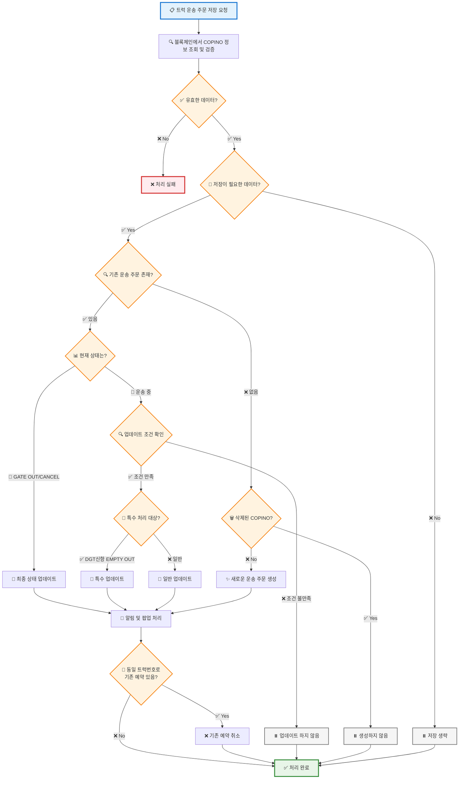

# saveTruckTransOrder 프로세스 플로우

## 주요 프로세스 단계

### 1️⃣ 검증 단계

- 블록체인에서 COPINO 정보 조회
- 데이터 유효성 및 저장 필요성 검증

### 2️⃣ 메인 처리 (분기)

**기존 주문이 있는 경우:**

- 현재 상태 확인 (GATE OUT/CANCEL vs 운송 중)
- 업데이트 조건 확인
- 특수 처리 대상 여부 확인 (DGT신항 EMPTY OUT)
- [[컨테이너 운송 업데이트(DGT)]]
- [[컨테이너 운송 업데이트(etc)]]

**신규 주문인 경우:**

- [[삭제된 COPINO가 아니면 새로운 운송 주문 생성]]

### 3️⃣ 후처리

- 알림 및 팝업 처리
- 동일 트럭번호로 기존 예약이 있으면 취소

### 📋 주요 분기점

- **데이터 유효성**: 블록체인 조회 결과 검증
- **저장 필요성**: 중복 데이터인지 확인
- **기존 주문 존재**: 업데이트 vs 신규 생성
- **현재 상태**: 최종 단계 vs 진행 중
- **특수 조건**: DGT신항 EMPTY OUT 처리
- **트럭번호 중복**: 기존 예약 취소 필요성