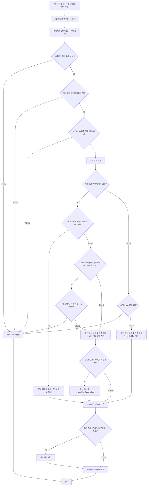

# saveTruckTransOrder 함수 플로우차트

  

```mermaid

flowchart TD

    A[시작: 파라미터 추출 및 오류상태 추출] --> B[기존 COPINO 데이터 조회]

    B --> C[블록체인 COPINO 데이터 조회]

    C --> D{블록체인 결과 유효성 체크}

    D -- 아니오 --> Z1[종료: false 반환]

    D -- 예 --> E{COPINO 데이터 유효성 체크}

    E -- 아니오 --> Z1

    E -- 예 --> F{COPINO 저장 필요 여부 체크}

    F -- 아니오 --> Z1

    F -- 예 --> G[주요 정보 추출]

    G --> H{기존 COPINO 데이터 있음?}

    H -- 예 --> I{GATE OUT 또는 CANCEL INOUT?}

    I -- 예 --> J[운송 데이터 업데이트 및 팝업 처리]

    J --> Y[isNeedFcmSend 반환]

    I -- 아니오 --> K{GATE IN 상태 및 논리오류 및 기존오류 아님?}

    K -- 예 --> L{삭제 상태 및 삭제 가능 시간 아님?}

    L -- 예 --> Z1

    L -- 아니오 --> M[일반 정보 체크 및 운송 데이터 업데이트, 팝업 처리]

    M --> N{DGT EMPTY OUT 특수처리?}

    N -- 예 --> O[특수 처리 후 isNeedFcmSend false]

    O --> Y

    N -- 아니오 --> Y

    K -- 아니오 --> M

    H -- 아니오 --> P{COPINO 삭제 상태?}

    P -- 예 --> Z1

    P -- 아니오 --> Q[일반 정보 체크 및 운송 데이터 생성, 팝업 처리]

    Q --> Y

    Y --> R{트럭번호 동일한 기존 데이터 있음?}

    R -- 예 --> S[예약 취소 처리]

    S --> T[isNeedFcmSend 반환]

    R -- 아니오 --> T

    T --> End[종료]

    Z1 --> End

```

  

---

  

- 각 분기에서 조건에 따라 함수가 종료되거나, 다음 단계로 넘어갑니다.

- 예외 발생 시에는 에러 로그를 남기고 false를 반환하며 종료됩니다.