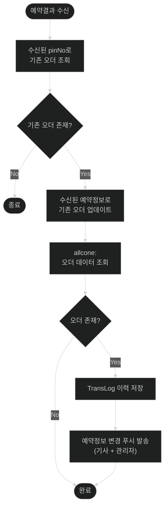

# 02. 예약결과 (ReservationResult)

## 개요

터미널에서 VBS 예약 승인/거절 결과 수신 시 호출.
bctrans에서 예약정보 DB 업데이트 → allcone에서 TransLog 저장 + FCM 푸시 발송.

## 전체 프로세스 플로우

```mermaid

---
config:
  theme: dark
---

flowchart TD
    START(["예약결과 수신"]) --> QUERY["수신된 pinNo로
    기존 오더 조회"]

    QUERY --> EXIST{"기존 오더 존재?"}
    EXIST -->|No| DONE_BC(["종료"])
    EXIST -->|Yes| UPDATE["수신된 예약정보로
    기존 오더 업데이트"]

    UPDATE --> AC_QUERY["allcone:
    오더 데이터 조회"]

    AC_QUERY --> AC_EXIST{"오더 존재?"}
    AC_EXIST -->|No| DONE(["종료"])
    AC_EXIST -->|Yes| LOG["TransLog 이력 저장"]
    LOG --> PUSH["예약정보 변경 푸시 발송
    (기사 + 관리자)"]
    PUSH --> DONE(["완료"])
```
