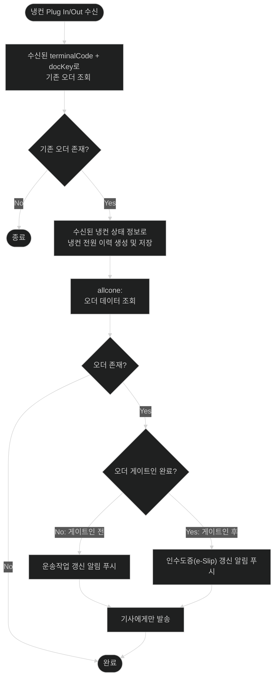

# 04. 냉컨 Plug In/Out (ReeferPlugInOutResult)

## 개요

터미널에서 냉동컨테이너 전원 연결/해제 결과 수신 시 호출.
bctrans에서 냉컨 전원 이력 저장 → allcone에서 게이트인 여부에 따라 다른 알림 FCM 푸시 발송.

## 전체 프로세스 플로우

```mermaid

---
config:
  theme: dark
---

flowchart TD
    START(["냉컨 Plug In/Out 수신"]) --> QUERY["수신된 terminalCode + docKey로
    기존 오더 조회"]

    QUERY --> EXIST{"기존 오더 존재?"}
    EXIST -->|No| DONE_BC(["종료"])
    EXIST -->|Yes| SAVE["수신된 냉컨 상태 정보로
    냉컨 전원 이력 생성 및 저장"]

    SAVE --> AC_QUERY["allcone:
    오더 데이터 조회"]

    AC_QUERY --> AC_EXIST{"오더 존재?"}
    AC_EXIST -->|No| DONE(["종료"])
    AC_EXIST -->|Yes| GATEIN{"오더 게이트인 완료?"}

    GATEIN -->|"No: 게이트인 전"| PUSH_ORDER["운송작업 갱신 알림 푸시"]
    GATEIN -->|"Yes: 게이트인 후"| PUSH_SLIP["인수도증(e-Slip) 갱신 알림 푸시"]

    PUSH_ORDER --> TARGET["기사에게만 발송"]
    PUSH_SLIP --> TARGET
    TARGET --> DONE(["완료"])
```
