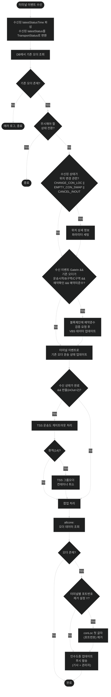

# 05. 터미널 이벤트 (Terminal Event)

## 개요

터미널 내부에서 발생하는 운송 진행 이벤트(게이트인/블록진입/작업완료/게이트아웃 등) 수신 시 호출.
bctrans에서 상태 업데이트 + 부가 처리 → allcone에서 인수도증 업데이트 FCM 푸시 발송.

## 포함되는 이벤트(method)

| method | 설명 | Controller에서 매핑하는 latestStatus |
|--------|------|------|
| GateIn | 터미널 게이트 진입 | (Controller에서 매핑 안함) |
| EnterBlock | 야드 블록 진입 | (Controller에서 매핑 안함) |
| JobDone | 하역/상차 작업 완료 | (Controller에서 매핑 안함) |
| GateOut | 터미널 게이트 반출 | (Controller에서 매핑 안함) |
| CancelInOut | 반출입 취소 | (Controller에서 매핑 안함) |
| EmptyConInspectionResult | 공컨테이너 EIR 검사 | EMPTY_CON_INSPTN_RESULT |
| EmptyConCleaningResult | 공컨테이너 세척 | EMPTY_CON_CLEAN_RESULT |
| EmptyConSwapResult | 공컨테이너 교환(스왑) | EMPTY_CON_SWAP_RESULT |
| ChangeConLoc | 장치장 위치 변경 | CHANGE_CON_LOC |
| OnEmptyConCPSArrival | CPS 도착 감지 | CPS_ARRIVAL |
| OnCPSAutomationStart | CPS 자동 하차 시작 | CPS_AUTO_START |

## 전체 프로세스 플로우

## 무시 조건 (isNeedIgnoreUpdateContainerTransportStatus)

| 기존 오더 상태 | 수신 이벤트 | 결과 | 사유 |
|--------------|-----------|------|------|
| CHANGE_CON_LOC | GateIn | 무시 | 위치변경 후 게이트인 이벤트 중복 방지 |
| CANCEL_INOUT | GateOut | 특정 터미널만 무시 (BPTS, BCT, BPTG) | 취소 후 게이트아웃 이벤트 정책 |
