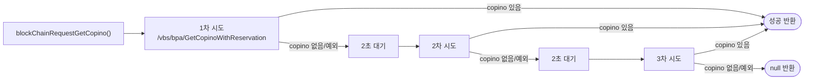
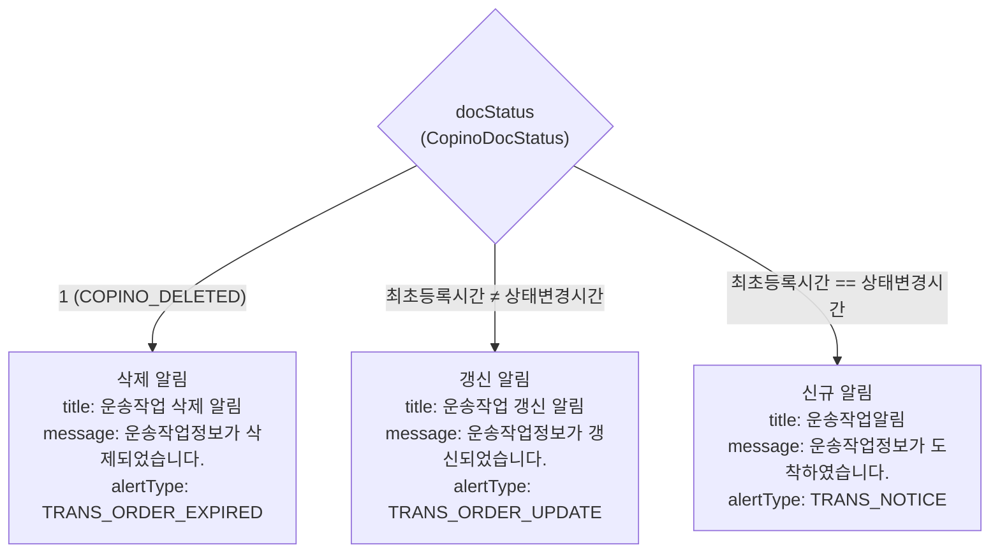

# 01. COPINO 검증결과 (CopinoVerificationResult)

## 개요

터미널에서 COPINO 검증이 완료되면 호출.
bctrans에서 블록체인 조회 → DB 저장/갱신 → allcone으로 FCM 푸시 전달.

## 트리거 조건

- `method` = `"CopinoVerificationResult"` 또는 `"CopinoVerificationResultWithReservation"`

## 소스 위치

| 역할 | 파일 | 메서드 |
|------|------|--------|
| bctrans DB 처리 | `bctrans/vbs/service/BctransVbsTruckTransOrderService.java` | `saveTruckTransOrder()` (line 195) |
| 블록체인 조회 | 위 파일 | `blockChainRequestGetCopino()` (line 120) |
| allcone 전달 | 위 파일 | `sendVbsAlarm()` (line 573) |
| FCM 발송 | `invoke/service/VbsInvokeAlarmService.java` | `sendCopinoVerificationPushToUser()` (line 109) |
| FCM 푸시 구성 | 위 파일 | `sendCopinoVerificationPushNotificationDataV2()` (line 282) |
| 예약 취소 | `allcone/vbs/service/AllconeVbsTruckTransOrderService.java` | `cancelAppointment()` (line 168) |

---

## 전체 플로우 (bctrans → allcone)

```mermaid
flowchart TD
    START(["CopinoVerificationResult 수신"]) --> INIT

    subgraph BCTRANS ["bctrans: saveTruckTransOrder()"]
        INIT["파라미터 추출\npinNo, terminalCode, docKey, inOutType"] --> EXIST_QUERY["기존 COPINO 데이터 조회\ngetAllconeTransportOrderDataForSaveCopino()"]
        EXIST_QUERY --> BC_CALL["블록체인 COPINO 조회\nblockChainRequestGetCopino()\n최대 3회 재시도, 2초 간격"]

        BC_CALL --> VALID{"유효한 응답?\nresult.message.copino\n존재 여부"}
        VALID -->|"No (null)"| RET_FALSE_1(["return false\nFCM 발송 안함"])

        VALID -->|Yes| NEED_SAVE{"COPINO 저장 필요?\nisNeedSaveCopino()\n※ 현재 항상 true"}
        NEED_SAVE -->|No| RET_FALSE_2(["return false"])
        NEED_SAVE -->|Yes| EXTRACT["copino, appointment, info 추출\nnewCopinoDocStatus, truckNo 파싱"]

        EXTRACT --> EXIST_CHECK{"기존 운송 오더\n존재?"}

        %% ===== 기존 오더 있음 =====
        EXIST_CHECK -->|Yes| GATEOUT{"상태가\nGATE_OUT 또는\nCANCEL_INOUT?"}

        GATEOUT -->|Yes| UPDATE_1["updateContainerTransport()\n운송정보 업데이트"]
        UPDATE_1 --> FCM_DIFF_1{"업데이트 전후\n데이터 변경 있음?"}
        FCM_DIFF_1 -->|Yes| POPUP_1["팝업 처리"]
        FCM_DIFF_1 -->|No| POPUP_1
        POPUP_1 --> TRUCK_CHECK

        GATEOUT -->|No| GATEIN_LE{"게이트인 완료\nAND LE에러\nAND 에러상태 아님?"}
        GATEIN_LE -->|"Yes"| SKIP(["스킵\n업데이트/FCM 없음"])
        SKIP --> TRUCK_CHECK

        GATEIN_LE -->|"No"| DEL_TIME{"삭제된 COPINO\nAND 등록 후\n6초 미경과?"}
        DEL_TIME -->|Yes| RET_FALSE_3(["return false\n삭제 보호 기간"])

        DEL_TIME -->|No| VALIDATE["컨테이너/트럭커 유효성 체크\ncheckGeneralContainerByCopino()\ncheckGeneralTruckerByCopino()"]
        VALIDATE --> DGT{"DGT신항\nEMPTY OUT?\nFeType=EMPTY\nInOut=OUT\nterminal=DGTBC050"}

        DGT -->|Yes| UPDATE_DGT["updateDgtEmptyOut\nContainerTransport()\nFCM 발송 안함"]
        UPDATE_DGT --> POPUP_2["팝업 처리"]
        POPUP_2 --> TRUCK_CHECK

        DGT -->|No| UPDATE_2["updateContainerTransport()\n일반 업데이트"]
        UPDATE_2 --> FCM_DIFF_2{"업데이트 전후\n데이터 변경 있음?"}
        FCM_DIFF_2 --> POPUP_3["팝업 처리"]
        POPUP_3 --> TRUCK_CHECK

        %% ===== 기존 오더 없음 =====
        EXIST_CHECK -->|No| NEW_DEL{"삭제된\nCOPINO?"}
        NEW_DEL -->|Yes| TRUCK_CHECK
        NEW_DEL -->|No| NEW_VALIDATE["컨테이너/트럭커 유효성 체크"]
        NEW_VALIDATE --> CREATE["createContainerTransportData()\n새 운송오더 생성"]
        CREATE --> POPUP_4["팝업 처리"]
        POPUP_4 --> TRUCK_CHECK

        %% ===== 기존 예약 취소 체크 =====
        TRUCK_CHECK{"기존 오더 존재\nAND 트럭번호\n동일?"}
        TRUCK_CHECK -->|No| RET_FCM(["return isNeedFcmSend"])
        TRUCK_CHECK -->|Yes| EXPIRED_QUERY["동일 컨테이너 오더 조회\ngetAllconeTransportOrderData\nForCheckExpired()"]
        EXPIRED_QUERY --> PINNO_CHECK{"pinNo 다름\nAND\nAPPT_CONPL 상태?"}
        PINNO_CHECK -->|No| RET_FCM
        PINNO_CHECK -->|Yes| CANCEL["기존 예약 취소\ncancelAppointment()\n+ 채팅 메시지:\n'운송작업 갱신으로 인해\n예약이 취소되었습니다.'"]
        CANCEL --> RET_FCM
    end

    RET_FCM --> FCM_GATE{"isNeedFcmSend?"}
    FCM_GATE -->|false| DONE(["완료"])

    FCM_GATE -->|true| SEND_VBS["sendVbsAlarm()\n→ allcone 인스턴스로 HTTP 전달\nPOST /vbs/invoke/alarm"]

    subgraph ALLCONE ["allcone: sendCopinoVerificationPushToUser()"]
        SEND_VBS --> AC_QUERY["기존 오더 조회\ngetAllconeTransportOrderData()"]
        AC_QUERY --> AC_NULL{"오더 데이터\n존재?"}
        AC_NULL -->|No| AC_ERR(["에러 로그, 종료"])

        AC_NULL -->|Yes| AC_FCM_SKIP{"에러상태 아님\nAND 게이트인 완료\nAND LE에러?"}
        AC_FCM_SKIP -->|Yes| AC_NO_FCM(["FCM 미발송\n로그만 출력"])

        AC_FCM_SKIP -->|No| AC_CONFIG["운송오더 알림 설정 체크\nalarmConfigCheck"]
        AC_CONFIG --> AC_TERMINAL{"터미널 VBS\n앱 사용(useVbsAppYn)?"}
        AC_TERMINAL -->|No| AC_ERR2(["디바이스 토큰 에러, 종료"])

        AC_TERMINAL -->|Yes| DOC_STATUS{"docStatus?"}
        DOC_STATUS -->|"1 (삭제)"| FCM_DEL["제목: 운송작업 삭제 알림\nAlertType: TRANS_ORDER_EXPIRED"]
        DOC_STATUS -->|"최초등록 != 상태변경"| FCM_UPD["제목: 운송작업 갱신 알림\nAlertType: TRANS_ORDER_UPDATE"]
        DOC_STATUS -->|"최초등록 == 상태변경"| FCM_NEW["제목: 운송작업알림\n(신규 도착)\nAlertType: TRANS_NOTICE"]

        FCM_DEL --> PUSH
        FCM_UPD --> PUSH
        FCM_NEW --> PUSH

        PUSH["FCM 푸시 발송"]
        PUSH --> DRIVER["기사 디바이스로 발송"]
        DRIVER --> ADMIN["TempAdmin 디바이스로 발송\n(여러 명 가능)"]
    end

    ADMIN --> DONE
```

## isNeedFcmSend 결정 기준

| 상황 | isNeedFcmSend | 사유 |
|------|:---:|------|
| GATE_OUT/CANCEL → 업데이트 후 변경 있음 | true | 실제 데이터 변경 발생 |
| GATE_OUT/CANCEL → 업데이트 후 변경 없음 | false | 동일 데이터, 중복 알림 방지 |
| 게이트인 + LE에러 + 비에러상태 | false | 스킵 (기존 정상 오더 보호) |
| 삭제 COPINO + 6초 미경과 | false | return false (삭제 보호 기간) |
| DGT신항 EMPTY OUT | false | DGT 전용 처리, 알림 불필요 |
| 일반 업데이트 → 변경 있음 | true | 실제 데이터 변경 발생 |
| 일반 업데이트 → 변경 없음 | false | 동일 데이터, 중복 알림 방지 |
| 신규 오더 생성 | true | 초기값 유지 |
| 블록체인 응답 null/예외 | false | return false |

## 블록체인 조회 재시도 로직

## 기존 예약 취소 상세 조건

기존 오더가 존재하고, 새 COPINO의 트럭번호가 기존과 동일할 때만 체크:

1. pinNo에서 컨테이너번호 추출 (예: `ABCD1234567_DOC001_0` → `ABCD1234567`)
2. 같은 터미널 + 같은 컨테이너 + 같은 반입출 방향의 오더 조회
3. 조회된 오더의 pinNo가 **현재 pinNo와 다르고** + **APPT_CONPL**(예약 준수) 상태이면
4. → 기존 예약 취소 + 채팅 메시지 "운송작업 갱신으로 인해 예약이 취소되었습니다."

## allcone FCM 푸시 분류

