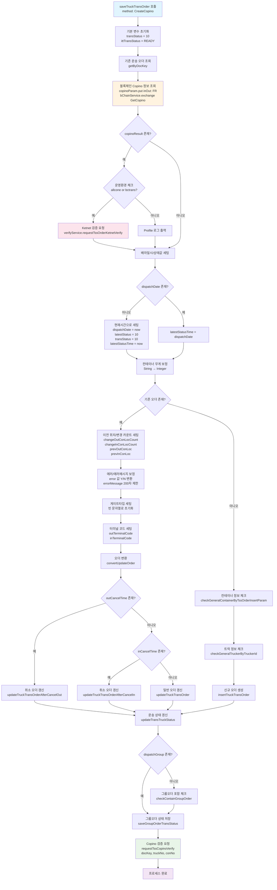

### 공통 시작 변수선언

```
        Map<String, Object> param = new HashMap<>(message);
        String now = LocalDateTime.now().format(DateTimeFormatter.ofPattern("yyyyMMddHHmmss"));
        int transStatus = 10;
        boolean isUpdateIgnored = false;
        IttTransStatus ittTransStatus = IttTransStatus.READY;
```

### CreateCopino




### GroupOrderGateIn

```mermaid
flowchart TD
    A[saveTruckTransOrder 호출<br/>method: GroupOrderGateIn] --> B[기본 변수 초기화<br/>transStatus = 10<br/>ittTransStatus = READY]
    
    B --> C[기존 운송 오더 조회<br/>getByDocKey]
    
    C --> D[transStatus 세팅<br/>latestStatus에서 값 가져오기]
    
    D --> E[ittTransStatus 파싱<br/>IttTransStatus.parse]
    
    E --> F[최신 상태 시간 세팅<br/>latestStatusTime 처리]
    
    F --> G[블록체인 Copino 정보 조회<br/>copinoParam inOut: FR<br/>bChainService.exchange GetCopino]
    
    G --> H[메시지 데이터 세팅<br/>docKey, transSn, shippingCode<br/>truckerId, outTerminalCode<br/>inTerminalCode, conNo, conType<br/>truckNo, outConLoc, dispatchGroup]
    
    H --> I{copinoResult 존재?}
    I -->|예| J[copino 데이터 추가 세팅<br/>conWeight, feType<br/>overLength, overWidth<br/>overHeight, temp, tempUnit]
    I -->|아니오| K[기존 그룹오더 조회<br/>getTruckTransGroupOrder]
    
    J --> K
    
    K --> L{기존 그룹오더 존재?}
    L -->|예| M[기존 그룹오더 삭제<br/>deleteTruckTransGroupOrder]
    L -->|아니오| N[컨테이너 무게 보정<br/>String to Integer]
    
    M --> N
    
    N --> O{기존 오더 존재?}
    O -->|예| P[이전 위치/변경 카운트 세팅<br/>changeOutConLocCount<br/>changeInConLocCount<br/>prevOutConLoc<br/>prevInConLoc]
    O -->|아니오| Q[컨테이너 정보 체크<br/>checkGeneralContainerByTssOrderInsertParam]
    
    P --> R[위치 변경 카운트 체크<br/>반출블록인/반출상차 위치변경시<br/>changeOutConLocCount 증가]
    
    R --> S[위치 변경 카운트 체크<br/>반입블록인/반입하차 위치변경시<br/>changeInConLocCount 증가]
    
    S --> T[에러/에러메시지 보정<br/>error 값 Y/N 변환<br/>errorMessage 200자 제한]
    
    T --> U[게이트타입 세팅<br/>특정 상태에서만 설정]
    
    U --> V[터미널 코드 세팅<br/>outTerminalCode<br/>inTerminalCode]
    
    V --> W{반입게이트인 and PNITC050?}
    W -->|예| X[데미지 확인 메시지 세팅<br/>etcMessage2]
    W -->|아니오| Y[오더 변환<br/>convertUpdateOrder]
    
    X --> Y
    
    Y --> Z{기존 오더의 outCancelTime 존재?}
    Z -->|예| AA[그룹오더 취소 후 갱신<br/>updateTruckTransOrderAfterGroupOrderCancelOut]
    Z -->|아니오| BB[일반 오더 갱신<br/>updateTruckTransOrder]
    
    AA --> CC[운송 상태 갱신<br/>updateTransTruckStatus]
    BB --> CC
    
    Q --> DD[트럭 정보 체크<br/>checkGeneralTruckerByTruckerId]
    DD --> EE[신규 오더 생성<br/>insertTruckTransOrder]
    EE --> CC
    
    CC --> FF{dispatchGroup 존재?}
    FF -->|아니오| GG[그룹오더 포함 체크<br/>checkContainGroupOrder]
    FF -->|예| HH[그룹오더 상태 저장<br/>saveGroupOrderTransStatus]
    
    GG --> HH
    
    HH --> II{ittTransStatus FROM_GATE_IN?}
    II -->|예| JJ[그룹오더 잔여컨테이너 체크<br/>checkRemainContainers]
    II -->|아니오| KK{ittTransStatus TO_UNLOAD<br/>or TO_GATE_OUT?}
    
    JJ --> LL[프로세스 완료]
    
    KK -->|예| MM[그룹오더 완료 체크<br/>checkGroupOrderDone]
    KK -->|아니오| LL
    
    MM --> NN{처리중인 그룹오더 없음?}
    NN -->|예| OO[그룹오더 다음 작업 처리<br/>nextJob]
    NN -->|아니오| LL
    
    OO --> LL
    
    style A fill:#e1f5fe
    style G fill:#fff3e0
    style HH fill:#e8f5e8
    style JJ fill:#fce4ec
    style MM fill:#f3e5f5
    style LL fill:#f0f0f0
```

