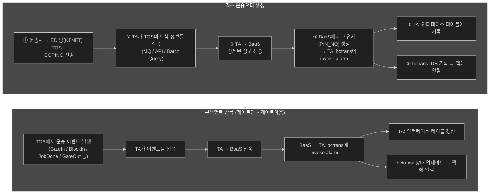
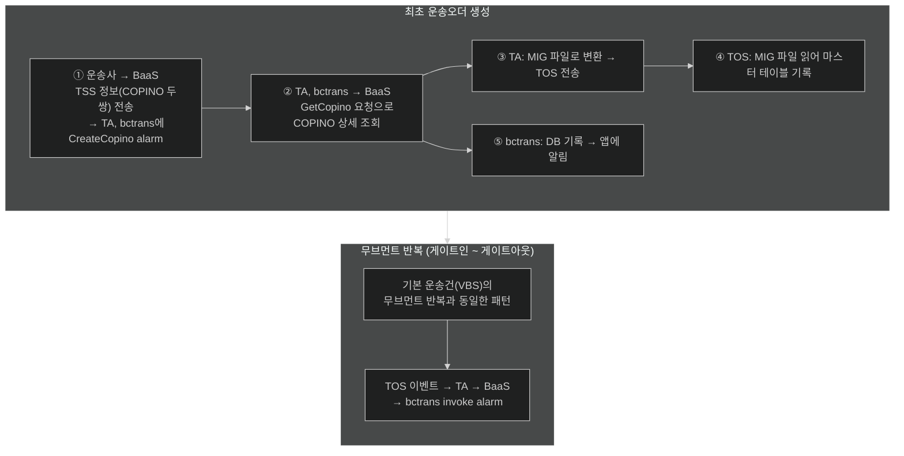
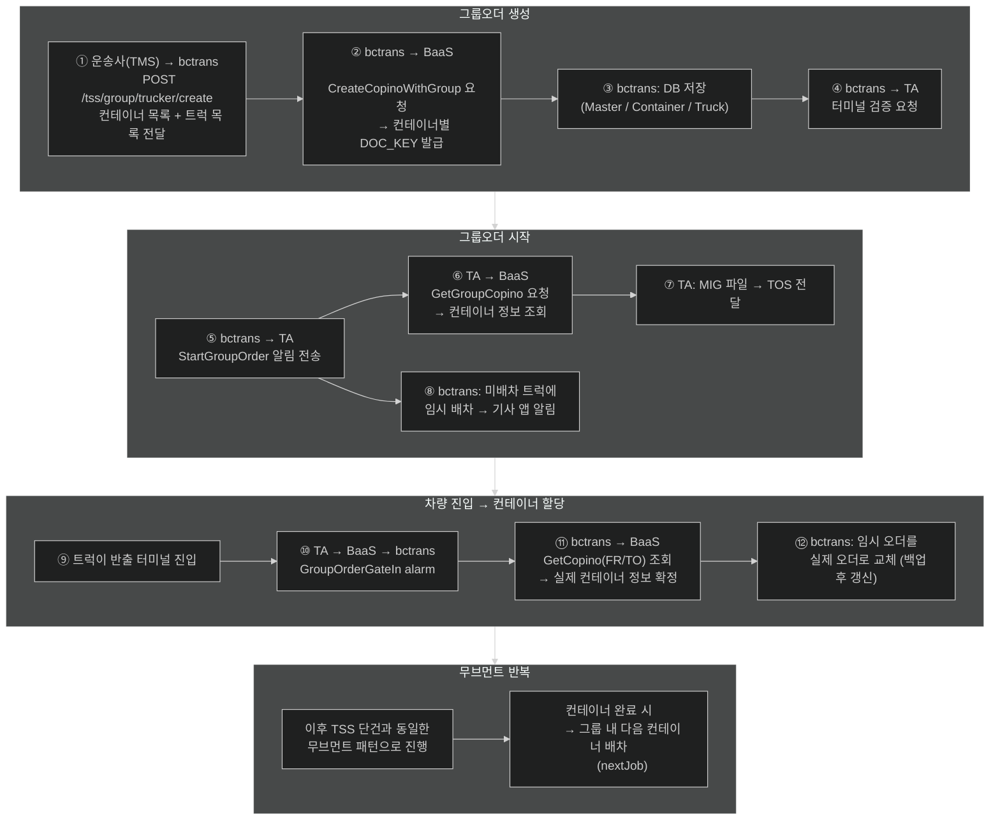

# 인프라 구성 및 프로세스 흐름

## 시스템 구성

| 시스템                            | 통칭      | 관리 주체    | 터미널 내/외    | 설명                           |
| ------------------------------ | ------- | -------- | ---------- | ---------------------------- |
| BaaS (Blockchain as a Service) | 블록체인    | smartm2m | 외부         | 운송 데이터 중계 + 고유키 발급           |
| Terminal Operating System      | TOS     | 각 터미널    | 내부         | 터미널 운영 시스템 (컨테이너/선박/야드 관리)   |
| Terminal Agent                 | TA      | smartm2m | 내부         | TOS ↔ 블록체인 연결 어댑터. 터미널마다 1개씩 |
| BCtrans/Allcone Backend        | bctrans | 컨테인어스    | 외부         | 운송오더 DB 관리 + 앱 알림 발송 서버      |
| Allcone 모바일 앱                  | 앱       | 컨테인어스    | 외부 (클라이언트) | 운송기사/관리자용 모바일 앱              |

## 핵심 용어

### 망 구분

| 구분 | 통칭 | 설명 |
|------|------|------|
| EDI망 (VBS) | VBS | 운송사 ↔ 중계사(KTNET) ↔ 터미널 간 데이터 교환 네트워크 |
| 블록체인 망 (TSS) | TSS | 운송사 ↔ BaaS ↔ TA 간 데이터 교환 네트워크 |

- 두 망의 역할은 동일 (운송 데이터 중계), **경유하는 인프라가 다를 뿐**
- KTNET: EDI망의 중계사. 운송오더를 EDI 표준 형식으로 변환하여 터미널에 전송

### 운송 관련

| 용어            | 설명                                                                              |
| ------------- | ------------------------------------------------------------------------------- |
| COPINO        | 운송사가 요청한 운송건. 운송오더와 동의어                                                         |
| e-Slip (인수도증) | 터미널에서 발급하는 전자 인수도증. 게이트 진입시 어디로 가서 뭘 실어야 될지 알려줌                                 |
| PIN_NO        | EDI망(VBS)에서 BaaS가 발급하는 운송건 고유키(`컨테이너번호_차량번호_반출입(1 or 2)_YYMMDD_seq(순차적으로 올라감)`) |
| DOC_KEY       | 블록체인 망(TSS)에서 BaaS가 발급하는 운송건 고유키(`선사_)                                          |

### 서비스 구분

| 서비스 | 설명 |
|--------|------|
| VBS (Vehicle Booking Service) | 운송예약서비스. 기사가 터미널에 "언제 갈 것이다"를 예약. EDI망을 통한 일반 운송건의 통칭으로도 사용됨 |
| TSS (== ITT) | 환적 운송. 반출 터미널 → 반입 터미널로 컨테이너를 이동하는 운송 방식. EDI망의 COPINO 두 건(반출+반입)을 블록체인 망에서 하나로 묶은 논리적 개념 |
| 그룹오더 (Group Order) | TSS를 여러 차량 × 여러 컨테이너로 묶은 단위. 어떤 차량이 어떤 컨테이너를 반출할지는 **반출 터미널 진입 시점에 결정** |

## 인프라간 프로세스 흐름

### 공통 원칙

- **고유키를 만드는 것은 항상 BaaS**. 최초에 BaaS에 고유키 생성을 요청하는 방식만 다를 뿐, 이후 무브먼트는 동일하게 처리
- **최초 운송오더 생성 이후**, 터미널 내 무브먼트(게이트인 ~ 게이트아웃)는 VBS/TSS 관계없이 동일한 패턴으로 반복

### 1. 기본 운송건 — EDI망 (VBS)

운송사가 EDI망을 통해 COPINO를 전송하고, 터미널에서 운송이 진행되는 기본 흐름.

> bctrans 진입점: `POST /vbs/invoke/alarm` → `VbsInvokeAlarmController`

### 2. TSS 단건 — 블록체인 망 (TSS)

운송사가 블록체인 망을 통해 TSS(반출+반입 묶음) 운송건을 생성하는 흐름.

> - BaaS가 발급하는 고유키는 **DOC_KEY**
> - bctrans 진입점: `POST /itt/invoke/alarm` → `IttInvokeAlarmController`
> - TSS는 반출/반입 두 터미널을 오가므로 무브먼트가 **반출 게이트인 ~ 반출 게이트아웃 ~ 반입 게이트인 ~ 반입 게이트아웃**까지 이어짐

### 3. TSS 그룹오더 — 블록체인 망 (TSS)

여러 차량 × 여러 컨테이너를 묶어 관리하는 그룹 운송 흐름.
그룹오더는 **bctrans가 오케스트레이션** 역할을 수행.

> - 그룹오더에서 bctrans가 중간에 끼는 이유: **여러 컨테이너를 하나의 dispatchGroup으로 묶는 전처리** + BaaS에 묶음 COPINO 생성 요청 등의 오케스트레이션
> - 컨테이너 할당은 반출 터미널 진입 시점에 결정되므로, 그 전까지 기사 앱에는 `"진입 시 할당"` 표시

## 참고: bctrans 진입점 요약

| 망 | 진입점 | Controller |
|----|--------|------------|
| EDI망 (VBS) | `POST /vbs/invoke/alarm` | `VbsInvokeAlarmController` |
| 블록체인 망 (TSS) | `POST /itt/invoke/alarm` | `IttInvokeAlarmController` |
| 그룹오더 관리 | `POST /tss/group/*` | `TssGroupOrderController` |

## 이벤트별 상세 플로우

- EDI망(VBS) 이벤트 상세: [docs/vbs-flow/](vbs-flow/README.md)
- 블록체인 망(TSS) 이벤트 상세: docs/tss-flow/ (작성 예정)
