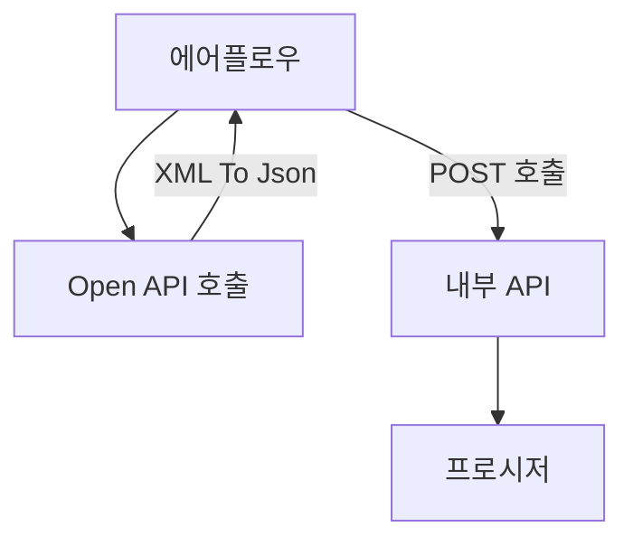

### Flow
1. 에어플로우에서 Open API를 호출해 XML을 Json형태로 변환
2. 전처리한 데이터를 에어플로우에서 BODY에 넣은 후 POST방식으로 WAS에 올라가있는 자바 API를 호출 
3. 자바 API에서는 받은 body를 오라클 DB의 프로시저에 전달(json형태)
4. 오라클에서 JSON처리 기능을 이용해 테이블에 Merge

### 상세
- 직업 상세정보
	- DAG : JOB_INFO_DAG
	- API : https://pknuai.pknu.ac.kr/web/upsertJobInfo?mId=210
	- TABLE : UNI_WORKNET_JOB_INFO
	1. 직업 상세정보 API호출
		- 모든 데이터를 Json형태로 변환
	2. API 호출
	   
- 일반학과 상세정보
	- DAG : MAJOR_DETAIL_DAG
	- API :  https://pknuai.pknu.ac.kr/web/upsertMajorDetail?mId=210
	1. 일반학과 상세정보 API호출(LOOP)
		- 요청 parameter 중 학과ID를 1씩 높여 호출 후 필요한 데이터만 Json형태로 변환 후 배열에 저장
		- 학과ID를 올렸을 때 더이상 데이터가 나타나지 않으면 계열ID를 하나 올린다.
		- 계열ID를 올렸을 때 더이상 데이터가 나타나지 않으면 모든 데이터를 가져왔다고 판단, LOOP 종료
	2. API 호출 

- 공채속보
	- DAG : OPEN_RECRUITMENT_DAG
	- API : https://pknuai.pknu.ac.kr/web/upsertOpenRecuritment?mId=210
	1. 배치주기(미정)마다 API 호출(LOOP)
		- 요청 parameter 중 시작페이지를 1씩 높여 호출 후 필요한 데이터만 Json형태로 변환 후 배열에 저장(display는 100으로 고정)
		- 시작페이지를 올렸을 때 더이상 데이터가 나타나지 않으면 모든 데이터를 가져왔다고 판단, LOOP 종료
	2. API 호출

   

   