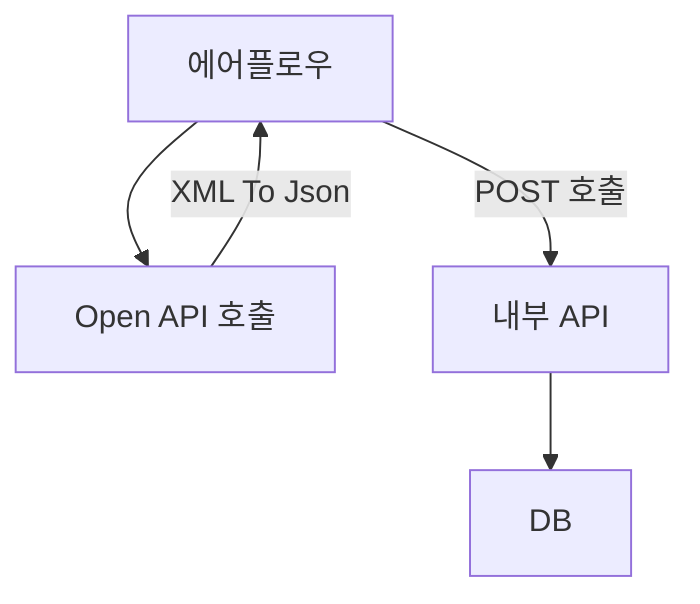

| 순번  | 코드명  |                  코드                  |
| :-: | :--: | :----------------------------------: |
|  1  | 학과정보 | abdc7bf0-81dd-46dc-b625-b243dc5d52c5 |
|  2  | 심리검사 | 75a1364d-8338-41ff-9f5f-7aba463a10bb |
|  3  | 직업정보 | 30ffd43b-309a-40c6-9720-598641031da4 |
|  4  | 채용정보 | cf3f171f-81d6-4801-bb9a-eab76684bc10 |
### Flow
1. 에어플로우에서 Open API를 호출해 XML을 Json형태로 변환
2. 전처리한 데이터를 에어플로우에서 BODY에 넣은 후 POST방식으로 WAS에 올라가있는 자바 API를 호출 
3. 자바 API에서는 받은 body를 DB에 upsert




### 상세
- 직업 상세정보
	- DAG : JOB_INFO_DAG
	- API : https://pknuai.pknu.ac.kr/web/upsertJobInfo?mId=210
	- TABLE : UNI_WORKNET_JOB_INFO
	1. 직업 상세정보 API호출
		- 모든 데이터를 Json형태로 변환
	2. API 호출
	3. API에서 Json을 처리 후 upsert
	   
- 일반학과 상세정보
	- DAG : MAJOR_DETAIL_DAG
	- API :  https://pknuai.pknu.ac.kr/web/upsertMajorDetail?mId=210
	- TABLE : UNI_WORKNET_MAJOR_DETAIL
	1. 일반학과 상세정보 API호출(LOOP)
		- 요청 parameter 중 학과ID를 1씩 높여 호출 후 필요한 데이터만 Json형태로 변환 후 배열에 저장
		- 학과ID를 올렸을 때 더이상 데이터가 나타나지 않으면 계열ID를 하나 올린다.
		- 계열ID를 올렸을 때 더이상 데이터가 나타나지 않으면 모든 데이터를 가져왔다고 판단, LOOP 종료
	2. API 호출 
	3. API에서 Json을 처리 후 upsert

- 공채속보
	- DAG : OPEN_RECRUITMENT_DAG
	- API : https://pknuai.pknu.ac.kr/web/upsertOpenRecuritment?mId=210
	1. 배치주기(미정)마다 API 호출(LOOP)
		- 요청 parameter 중 시작페이지를 1씩 높여 호출 후 필요한 데이터만 Json형태로 변환 후 배열에 저장(display는 100으로 고정)
		- 시작페이지를 올렸을 때 더이상 데이터가 나타나지 않으면 모든 데이터를 가져왔다고 판단, LOOP 종료
	2. API 호출
	3. API에서 Json을 처리 후 upsert

   


   ### 검사결과 샘플
```
This XML file does not appear to have any style information associated with it. The document tree is shown below.  

<examRsltRoot>

<adultJobAptExam>

<total>0</total>

</adultJobAptExam>

<adultJobAptReviseExam>

<total>0</total>

</adultJobAptReviseExam>

<jobPrefExamS>

<total>1</total>

<examRslt>

<psyExamCd>S</psyExamCd>

<psyExamNo>000043863051</psyExamNo>

<examDt>20241112</examDt>

<intrst1Nm>R</intrst1Nm>

<intrst1Sco>8</intrst1Sco>

<intrst2Nm>I</intrst2Nm>

<intrst2Sco>3</intrst2Sco>

<score1Nm>R</score1Nm>

<score1Rw>8</score1Rw>

<score1St>55</score1St>

<score2Nm>I</score2Nm>

<score2Rw>3</score2Rw>

<score2St>44</score2St>

<score3Nm>A</score3Nm>

<score3Rw>3</score3Rw>

<score3St>35</score3St>

<score4Nm>S</score4Nm>

<score4Rw>3</score4Rw>

<score4St>36</score4St>

<score5Nm>E</score5Nm>

<score5Rw>1</score5Rw>

<score5St>38</score5St>

<score6Nm>C</score6Nm>

<score6Rw>3</score6Rw>

<score6St>38</score6St>

<jobInfo>[{"oesCd":"8161","oesNm":"일반기계조립원"},{"oesCd":null,"oesNm":"금속재료공학시험원"},{"oesCd":"1222","oesNm":"생명과학 시험원"},{"oesCd":null,"oesNm":"선박조립원"},{"oesCd":null,"oesNm":"영상 녹회 및 편집기사"},{"oesCd":null,"oesNm":"웹엔지니어"},{"oesCd":"8171","oesNm":"자동차 조립원"},{"oesCd":"8124","oesNm":"자동차정비원"},{"oesCd":"1212","oesNm":"자연과학시험원"},{"oesCd":null,"oesNm":"전기, 전자 및 기계공학 시험원"},{"oesCd":null,"oesNm":"전기안전기술자"},{"oesCd":null,"oesNm":"송배전설비기술자"},{"oesCd":null,"oesNm":"전자계측제어기술자"},{"oesCd":"1404","oesNm":"조경기술자"},{"oesCd":null,"oesNm":"철도 기관차 및 전동차 정비원"},{"oesCd":null,"oesNm":"통신 및 관련장비설치 및 수리원"},{"oesCd":"8221","oesNm":"판금원"},{"oesCd":null,"oesNm":"고무 및 플라스틱화학공학기술자, 도료 및 농약품화학공학기술자, 석유화학공학기술자, 음식료품화학공학기술자, 의약품화학공학기술자, 비우 및 화장품 화학공학기술자, 화학분석시험원"},{"oesCd":"1542","oesNm":"화학공학 시험원"},{"oesCd":null,"oesNm":"환경공학 기술자 및 연구원, 환경공학시험원"},{"oesCd":null,"oesNm":"건축설계기술자"},{"oesCd":null,"oesNm":"교통계획 및 설계가"},{"oesCd":null,"oesNm":"산업기계 공학기술자(메카트로닉스)"},{"oesCd":null,"oesNm":"기계공학기술자"},{"oesCd":null,"oesNm":"발전설비기술자"},{"oesCd":null,"oesNm":"산업공학기술자"},{"oesCd":"1561","oesNm":"섬유공학기술자 및 연구원"},{"oesCd":null,"oesNm":"가스, 에너지 기술자 및 연구원"},{"oesCd":"3011","oesNm":"전문의사"},{"oesCd":null,"oesNm":"의료장비기사"},{"oesCd":null,"oesNm":"의약품화학공학기술자"},{"oesCd":null,"oesNm":"자동차공학기술자"},{"oesCd":"1312","oesNm":"통신공학 기술자 및 연구원"},{"oesCd":null,"oesNm":"컴퓨터 하드웨어 기술자"},{"oesCd":null,"oesNm":"조선(선박), 항공기 및 철도차량 공학기술자"},{"oesCd":null,"oesNm":"해양공학기술자"},{"oesCd":null,"oesNm":"건축가 및 건축공학 기술자"}]</jobInfo>

</examRslt>

</jobPrefExamS>

<founfExamAptd>

<total>0</total>

</founfExamAptd>

<jobValsExam>

<total>0</total>

</jobValsExam>

<youthJobIntrstExam>

<total>0</total>

</youthJobIntrstExam>

<tngrOccpIntsExam>

<total>0</total>

</tngrOccpIntsExam>

<univMajorIntrstExam>

<total>0</total>

</univMajorIntrstExam>

<youthHiStudAptdExam>

<total>0</total>

</youthHiStudAptdExam>

<prefExamLNewExam>

<total>0</total>

</prefExamLNewExam>

<fndJobExamRdyExam>

<total>0</total>

</fndJobExamRdyExam>

<univPathRdyExam>

<total>0</total>

</univPathRdyExam>

</examRsltRoot>
```