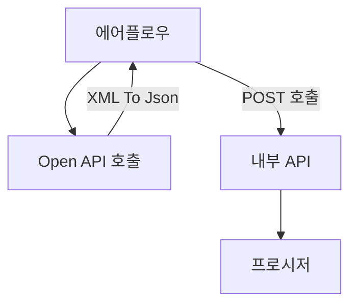

### Flow
1. 에어플로우에서 Open API를 호출해 XML을 Json형태로 변환
2. 전처리한 데이터를 에어플로우에서 BODY에 넣은 후 POST방식으로 WAS에 올라가있는 자바 API를 호출 
3. 자바 API에서는 받은 body를 오라클 DB의 프로시저에 전달(json형태)
4. 오라클에서 JSON처리 기능을 이용해 테이블에 Merge

### 상세
- 직업 상세정보
	- DAG : JOB_INFO_DAG
	- API : 미정
	1. 직업 상세정보 API호출
	2. 모든 데이터를 Json형태로 변환
	3. API 호출
	   
- 전공 상세정보
	- DAG : 

   

   