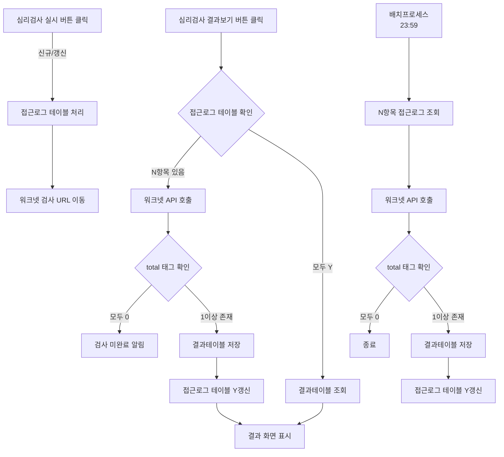

```mermaid
flowchart TD
    A[심리검사 실시 버튼 클릭] -->|신규/갱신| B[접근로그 테이블 처리]
    B --> C[워크넷 검사 URL 이동]
    
    D[심리검사 결과보기 버튼 클릭] --> E{접근로그 테이블 확인}
    E -->|N항목 있음| F[워크넷 API 호출]
    E -->|모두 Y| G[결과테이블 조회]
    
    F --> H{total 태그 확인}
    H -->|모두 0| I[검사 미완료 알림]
    H -->|1이상 존재| J[결과테이블 저장]
    J --> K[접근로그 테이블 Y갱신]
    K --> L[결과 화면 표시]
    G --> L
    
    M[배치프로세스\n23:59] --> N[N항목 접근로그 조회]
    N --> O[워크넷 API 호출]
    O --> P{total 태그 확인}
    P -->|1이상 존재| Q[결과테이블 저장]
    Q --> R[접근로그 테이블 Y갱신]
    P -->|모두 0| S[종료]
```
