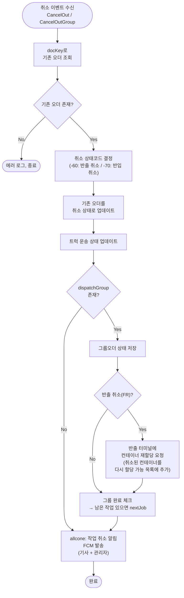

# 취소 (CancelOut)

## 개요

터미널에서 반출입 취소 발생 시 호출.
bctrans에서 취소 상태 업데이트 + 그룹오더 연동 후, allcone에서 취소 알림 FCM 푸시 발송.

## 취소 상태코드 결정

| 조건 | latestStatus | 의미 |
|------|-------------|------|
| inOut이 null이고 기존 오더 상태 < 90 | -60 | 반출 취소 |
| inOut이 null이고 기존 오더 상태 ≥ 90 | -70 | 반입 취소 |
| inOut == "FR" | -60 | 반출 취소 |
| inOut != "FR" | -70 | 반입 취소 |

## 전체 프로세스 플로우

## 그룹오더 반출 취소 시 컨테이너 재할당 요청

반출 취소(inOut == "FR")인 경우, 취소된 컨테이너를 반출 터미널에서 다시 다른 트럭에 할당할 수 있도록
터미널에 재할당 요청을 보냅니다.

제외 조건:
- 터미널 업데이트 인터페이스가 비활성화된 경우
- BNCT, HKTG 터미널은 제외

## 관련 테이블

| 시점 | 테이블 | 동작 | 비고 |
|------|--------|------|------|
| 취소 상태 업데이트 | `tb_b_truck_trans_odr` | UPDATE | latestStatus = -60(반출) 또는 -70(반입) |
| 트럭 운송 상태 | `tb_b_trans_trucks` | UPDATE | 트럭별 현재 운송 상태 갱신 |
| 그룹오더 상태 | `tb_b_tss_group_order_m` | UPDATE | dispatchGroup 존재 시 |
