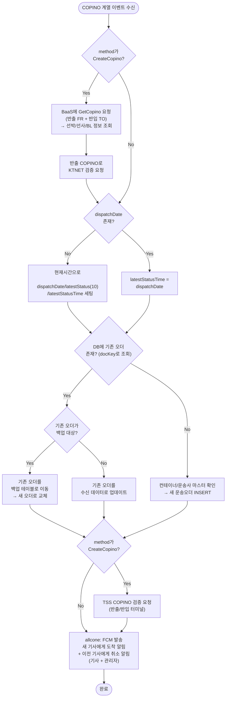

# COPINO 계열 (CreateCopino)

## 개요

운송사(TMS)가 BaaS를 통해 TSS 운송건을 생성하거나 차량을 변경할 때 호출.
bctrans에서 BaaS COPINO 조회 → DB 저장/갱신 → KTNET 검증 요청 후, allcone에서 FCM 푸시 발송.

## 용어 구분

- **CreateDispatchInfo**: 배차 정보 생성 (COPINO 없이 배차만)
- **CreateCopino**: COPINO 생성 (블록체인에서 반출/반입 COPINO 상세 조회 포함)
- **ChangeTruckNo**: 차량번호 변경 (기존 기사 취소 + 새 기사 배정)

## 전체 프로세스 플로우

## 백업 대상 조건 (isNeedBackupWhenUpdateByCreateCopino)

기존 오더가 존재하는 상태에서 새 CreateCopino가 들어올 때,
기존 오더의 상태에 따라 **백업 후 교체**할지 **단순 업데이트**할지 결정합니다.

> 백업 = 기존 오더를 백업 테이블로 이동시키고, 새 데이터로 원본 테이블에 INSERT

## 관련 테이블

| 시점 | 테이블 | 동작 | 비고 |
|------|--------|------|------|
| 운송오더 신규 생성 | `tb_b_truck_trans_odr` | INSERT | 컨테이너/운송사 마스터 확인 후 |
| 운송오더 업데이트 | `tb_b_truck_trans_odr` | UPDATE | 기존 오더에 수신 데이터 덮��쓰기 |
| 운송오더 백업 | `tss_truck_trans_order_backup` | INSERT | 기존 오더 백업 후 원본 교체 |
| 트럭 운송 상태 | `tb_b_trans_trucks` | UPDATE | 트럭별 현재 운송 상태 갱신 |
