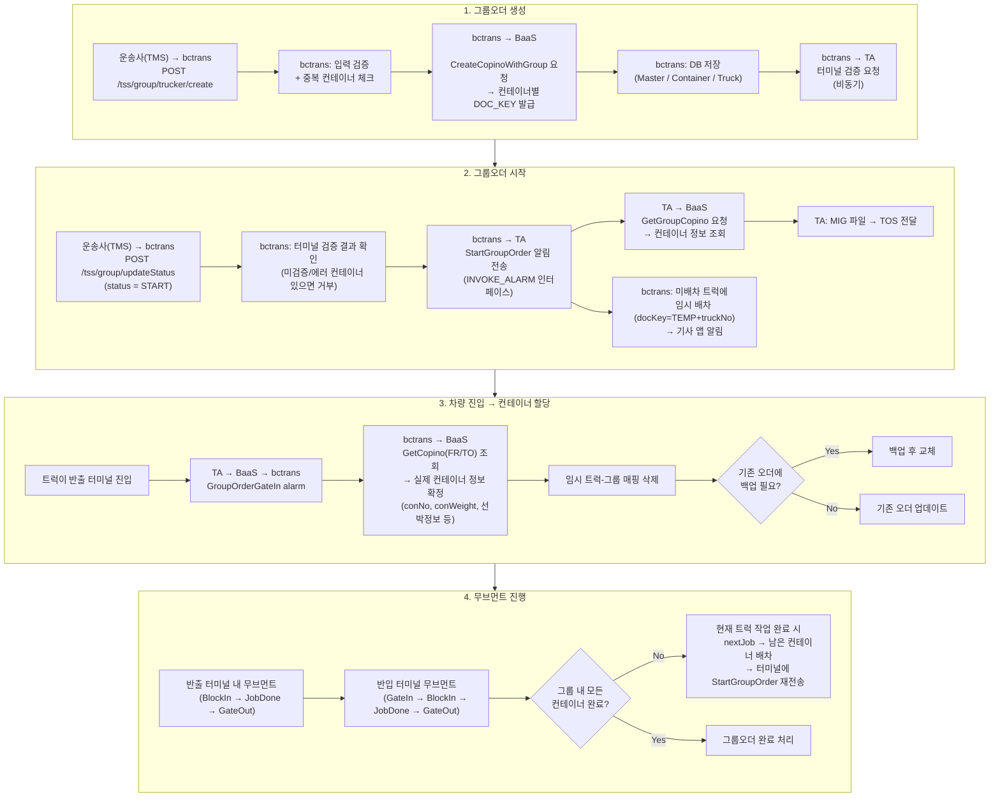
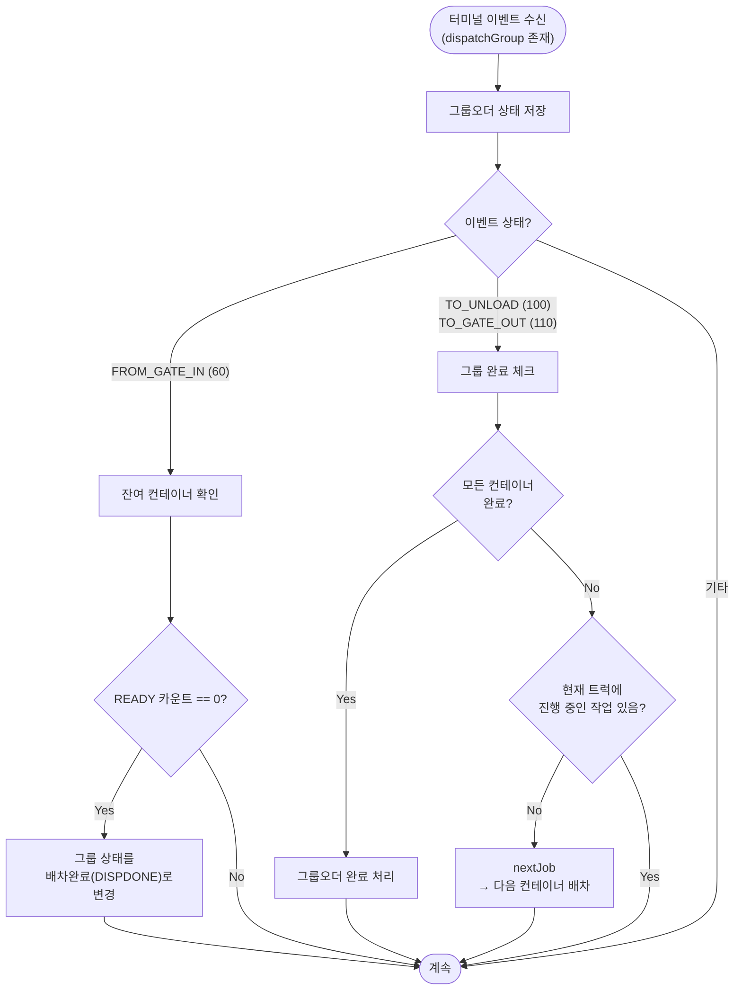

# 그룹오더 (GroupOrder)

## 개요

여러 차량 × 여러 컨테이너를 묶어 관리하는 TSS 그룹 운송.
어떤 차량이 어떤 컨테이너를 반출할지는 **반출 터미널 진입 시점에 결정**.
invoke alarm 외에 별도의 REST API(`/tss/group/*`)로 CRUD를 관리.

## 그룹오더 전체 라이프사이클

## 임시 배차 상세

그룹오더 시작 시, 아직 컨테이너가 할당되지 않은 트럭에 임시 오더를 생성합니다.

| 필드 | 값 |
|------|-----|
| docKey | `"TEMP" + truckNo` |
| conNo | 없음 (앱에서 `"진입 시 할당"` 표시) |
| transStatus | READY (10) |
| dispatchGroup | 실제 그룹 ID |
| outTerminalCode / inTerminalCode | 실제 터미널 코드 |

임시 오더는 `GroupOrderGateIn` 수신 시 삭제되고 실제 오더로 교체됩니다.

## 그룹오더 상태 연동 (invoke alarm 수신 시)

invoke alarm으로 터미널 이벤트를 수신할 때, `dispatchGroup`이 존재하면 아래 추가 처리가 발생합니다.

## 관련 API 엔드포인트

| API | 설명 |
|-----|------|
| `POST /tss/group/trucker/create` | 운송사(TMS)에서 그룹오더 생성 |
| `POST /tss/group/trucker/update` | 운송사(TMS)에서 그룹오더 수정 |
| `POST /tss/group/trucker/verify` | 운송사(TMS)에서 검증 요청 |
| `POST /tss/group/updateStatus` | 그룹오더 상태 변경 (START/CANCEL 등) |
| `POST /tss/group/create` | 체인포탈 웹에서 그룹오더 생성 |
| `POST /tss/group/delete/{dispatchGroup}` | 그룹오더 삭제 |
| `POST /tss/group/{dispatchGroup}` | 그룹오더 조회 |
| `POST /tss/group/list` | 그룹오더 목록 조회 |

## StartGroupOrder/RestartGroupOrder invoke alarm 처리

BaaS를 통해 `StartGroupOrder`/`RestartGroupOrder` invoke alarm이 bctrans에 도착하면,
Controller에서 그룹오더 생성/시작 로직과는 별도로 **트럭-그룹 매핑 테이블을 upsert**합니다.

이는 TA가 StartGroupOrder를 수신한 후 BaaS를 거쳐 bctrans에도 콜백이 오는 구조입니다.

## 관련 테이블

### 그룹오더 생성/관리

| 시점 | 테이블 | 동작 | 비고 |
|------|--------|------|------|
| 그룹오더 마스터 생성 | `tb_b_tss_group_order_m` | INSERT | dispatchGroup, 터미널, 운송사 등 |
| 그룹오더 컨테이너 등록 | `tb_b_tss_group_order_c` | INSERT | 컨테이너별 docKey, conNo 등 |
| 그룹오더 트럭 등록 | `tb_b_tss_group_order_t` | INSERT | 트럭 목록 |
| 그룹오더 상태 변경 | `tb_b_tss_group_order_m` | UPDATE | START/DISPDONE/COMPLETE 등 |

### 임시 배차 → 실제 배차

| 시점 | 테이블 | 동작 | 비고 |
|------|--------|------|------|
| 임시 배차 생성 | `tb_b_truck_trans_odr_grp` | INSERT/UPDATE | docKey=TEMP+truckNo |
| StartGroupOrder alarm 수신 | `tb_b_truck_trans_odr_grp` | UPSERT | 트럭-그룹 매핑 |
| GroupOrderGateIn 수신 | `tb_b_truck_trans_odr_grp` | DELETE | 임시 매핑 삭제 |
| GroupOrderGateIn 수신 | `tb_b_truck_trans_odr` | INSERT/UPDATE | 실제 컨테이너 정보로 오더 생성/교체 |
| 백업 필요 시 | `tss_truck_trans_order_backup` | INSERT | 기존 오더 백업 |

### 그룹오더 진행/완료

| 시점 | 테이블 | 동작 | 비고 |
|------|--------|------|------|
| 무브먼트 수신 | `tb_b_truck_trans_odr` | UPDATE | 운송 상태 업데이트 |
| 그룹 상태 저장 | `tb_b_tss_group_order_m` | UPDATE | 잔여 카운트, 완료 처리 등 |
| 트럭 운송 상태 | `tb_b_trans_trucks` | UPDATE | 트럭별 현재 운송 상태 갱신 |
