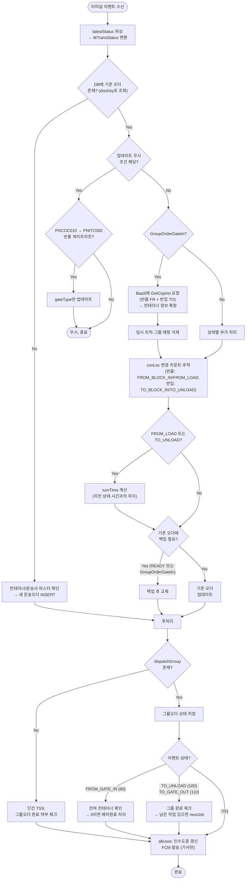

# 터미널 이벤트 (TerminalEvent)

## 개요

터미널 내에서 발생하는 운송 진행 이벤트 수신 시 호출.
TSS는 반출 터미널(FROM)과 반입 터미널(TO) 두 곳을 거치므로,
무브먼트가 반출 게이트인(60) ~ 반출 게이트아웃(80) ~ 반입 게이트인(90) ~ 반입 게이트아웃(110)까지 이어집니다.

## 포함되는 이벤트

COPINO 계열(CreateDispatchInfo/CreateCopino/ChangeTruckNo)과 취소(CancelOut/CancelOutGroup)를 제외한
모든 이벤트가 여기에 해당합니다. 주요 이벤트:

| method | latestStatus | 설명 |
|--------|-------------|------|
| GateIn (반출) | 60 | 반출 터미널 게이트 진입 |
| BlockIn (반출) | 65 | 반출 터미널 블럭 진입 |
| JobDone (반출) | 70 | 반출 터미널 상차 완료 |
| GateOut (반출) | 80 | 반출 터미널 게이트 진출 |
| GateIn (반입) | 90 | 반입 터미널 게이트 진입 |
| BlockIn (반입) | 95 | 반입 터미널 블럭 진입 |
| JobDone (반입) | 100 | 반입 터미널 하차 완료 |
| GateOut (반입) | 110 | 반입 터미널 게이트 진출 |
| GroupOrderGateIn | 60 | 그룹오더 차량 반출 터미널 진입 |

## 전체 프로세스 플로우

## 업데이트 무시 조건

기존 오더가 **반입 터미널 운송 중**(반입 게이트인 완료 + 반입 게이트아웃 미완료)이고,
수신 이벤트의 상태가 **반출 터미널 이벤트(60~80)**인 경우 무시합니다.

| 기존 오더 상태 | 수신 이벤트 | 결과 | 사유 |
|--------------|-----------|------|------|
| 반입 운송 중 (toGateIn 완료, toGateOut 미완료) | 반출 이벤트 (status 60~80) | 무시 | 이미 반입 터미널에 진입한 상태에서 반출 이벤트가 중복 수신되는 경우 방지 |

예외: `PNCOC010(반출) → PNITC050(반입)` 경로에서 반출 게이트아웃 이벤트는 gateType만 업데이트합니다.

## 상태별 부가 처리

| 상태 | 처리 |
|------|------|
| FROM_LOAD (70) | 반출 rehandleCount(재작업 횟수) 파싱 |
| FROM_LOAD (70) / TO_UNLOAD (100) | turnTime 계산 (이전 상태 시간과의 차이, 분 단위) |
| TO_GATE_OUT (110) | transDoneTime 기록 |
| FROM_GATE_OUT / TO_GATE_IN / TO_UNLOAD | gateType 보존 |
| TO_GATE_IN + PNITC050 | etcMessage2 = "데미지 확인 후 반입" |

## 관련 테이블

| 시점 | 테이블 | 동작 | 비고 |
|------|--------|------|------|
| 운송오더 신규 생성 | `tb_b_truck_trans_odr` | INSERT | 기존 오더 없을 때 |
| 운송 상태 업데이트 | `tb_b_truck_trans_odr` | UPDATE | latestStatus, conLoc, turnTime 등 |
| 운송오더 백업 | `tss_truck_trans_order_backup` | INSERT | READY/GroupOrderGateIn 시 백업 필요한 경우 |
| gateType만 업데이트 | `tb_b_truck_trans_odr` | UPDATE | 무시 조건 예외 (PNCOC010→PNITC050) |
| 트럭 운송 상태 | `tb_b_trans_trucks` | UPDATE | 트럭별 현재 운송 상태 갱신 |
| 그룹오더 상태 | `tb_b_tss_group_order_m` | UPDATE | dispatchGroup 존재 시 |
| 운송이력 저장 | `tb_b_trans_odr_h` | INSERT | GateOut/JobDone + latestStatus ≥ 100 |
| 운송상태이력 | `tb_b_trans_status_h` | INSERT | 운송이력과 함께 저장 |
