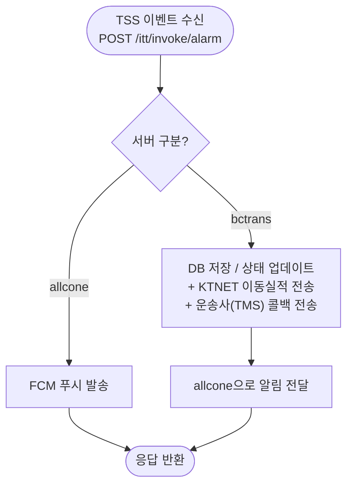
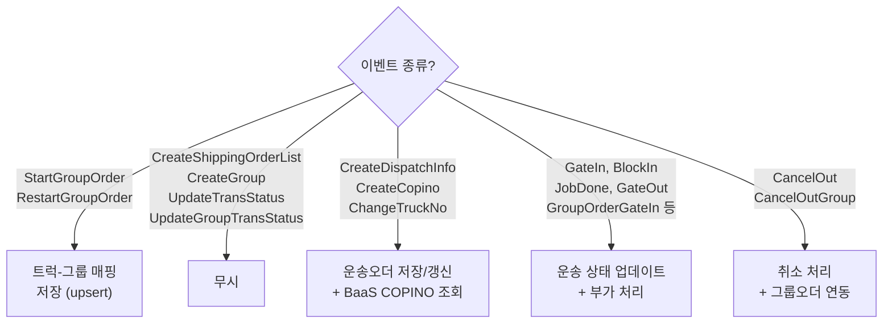
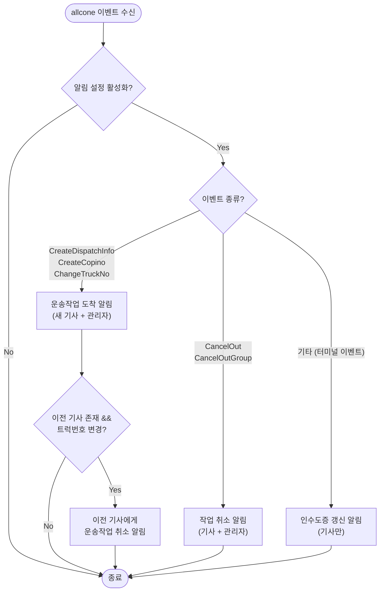

# TSS Invoke Alarm - 공통 진입점

## 개요

BaaS에서 TSS 운송 이벤트 발생 시 `POST /itt/invoke/alarm`으로 호출.
serverName에 따라 bctrans(DB 처리) → allcone(FCM 푸시) 순서로 분기.

## 진입 분기

> VBS와 달리 TSS는 bctrans 처리 후 **항상** allcone으로 알림을 전달합니다 (FCM 발송 여부 게이트 없음).

## 이벤트별 처리 분기

## bctrans 공통 후처리

COPINO 계열, 터미널 이벤트, 취소를 제외한 그룹오더 시작/재시작을 제외하고,
모든 이벤트는 아래 공통 후처리를 거칩니다.

| 순서 | 처리 | 조건 |
|------|------|------|
| 1 | 운송오더 DB 저장/갱신 | 항상 |
| 2 | KTNET 이동실적 전송 | CreateCopino 제외 |
| 3 | 운송사(TMS)에 터미널 이벤트 콜백 | 항상 |
| 4 | 운송이력 저장 | GateOut/JobDone이고 latestStatus ≥ 100 (반입 완료 이후) |

## allcone FCM 발송 분기

