# COPINO 검증결과 (CopinoVerificationResult)

## 개요

TOS에서 COPINO 검증 완료 → TA가 읽어서 BaaS에 전달 → BaaS가 bctrans에 invoke alarm.
bctrans에서 블록체인 조회 → DB 저장/갱신 후, allcone에서 FCM 푸시 발송.

## 용어 구분

- **기존 오더**: DB에 이미 저장된 운송오더 데이터
- **수신 오더**: BaaS에서 들어온 요청 파라미터(param) + 블록체인에서 조회한 COPINO 데이터

## 전체 프로세스 플로우

```mermaid


flowchart TD
    START(["COPINO 검증결과 수신"]) --> QUERY_EXIST["DB에서 기존 오더 조회"]
    QUERY_EXIST --> BC_QUERY["요청 값으로
    블록체인에 COPINO 정보 조회"]

    BC_QUERY --> VALID{"블록체인에서 조회한
    COPINO가 유효한지 확인?"}
    VALID -->|No| END_NO_FCM(["종료, FCM 없음"])

    VALID -->|Yes| EXIST{"DB에서 조회한
    기존오더가 존재?"}

    %% ===== 기존 오더 있음 =====
    EXIST -->|Yes| GATEOUT{"기존오더 상태가
    GATE_OUT ||
    CANCEL_INOUT?"}

    GATEOUT -->|"Yes: 이미 끝난 오더"| UPDATE_1["수신 오더로 업데이트"]
    UPDATE_1 --> POPUP

    GATEOUT -->|No| GATEIN_LE{"기존오더 게이트인 완료
    && 수신 오더 에러타입 LE
    && 기존 오더 에러상태 아님?"}
    GATEIN_LE -->|"Yes: 기존 오더가 터미널 내
    수신 오더는 잘못 전송
    기존 오더도 정상"| END_SKIP(["스킵, FCM 없음"])

    GATEIN_LE -->|No| DEL_TIME{"수신 오더 copinoDocStatus
    삭제 상태 &&
    기존오더 최초 등록 후
    6초 미경과?"}
    DEL_TIME -->|"Yes: 삭제불가 코피노"| END_NO_FCM_2(["종료, FCM 없음"])

    DEL_TIME -->|No| MASTER["수신 오더의
    컨테이너와 운송사
    검증 및 등록"]
    MASTER --> DGT{"기존오더가
    DGT신항 EMPTY OUT?
    FeType=EMPTY &&
    InOut=OUT &&
    terminal=DGTBC050"}

    DGT -->|Yes| UPDATE_DGT["DGT 전용
    운송정보 업데이트
    (FCM 발송 안함)"]
    UPDATE_DGT --> POPUP

    DGT -->|No| UPDATE_2["기존오더를
    수신 오더로 업데이트"]
    UPDATE_2 --> POPUP

    %% ===== 기존 오더 없음 =====
    EXIST -->|No| NEW_DEL{"수신 오더
    copinoDocStatus가
    삭제 상태?"}
    NEW_DEL -->|Yes| POPUP
    NEW_DEL -->|No| NEW_MASTER["수신 오더의
    컨테이너와 운송사
    검증 및 등록"]
    NEW_MASTER --> CREATE["수신 오더로
    새 운송오더 생성"]
    CREATE --> POPUP

    %% ===== 공통 후처리 =====
    POPUP["팝업 처리"] --> TRUCK{"기존오더 존재 &&
    기존 오더 트럭번호 ==
    수신 오더 트럭번호?"}
    TRUCK -->|No| RET(["FCM 발송 여부 반환"])
    TRUCK -->|Yes| EXPIRED_QUERY["동일 컨테이너의
    다른 오더 조회
    (expiredData)"]
    EXPIRED_QUERY --> PINNO{"expiredData pinNo !=
    수신 오더 pinNo &&
    expiredData가
    예약 준수 상태?"}
    PINNO -->|No| RET
    PINNO -->|Yes| CANCEL["해당 오더의
    기존 예약 취소"]
    CANCEL --> RET

    %% ===== allcone FCM 발송 =====
    RET --> FCM_GATE{"FCM 발송?"}
    FCM_GATE -->|No| DONE(["완료"])

    FCM_GATE -->|Yes| AC_QUERY["allcone:
    오더 데이터 조회"]

    AC_QUERY --> AC_NULL{"오더 존재?"}
    AC_NULL -->|No| DONE

    AC_NULL -->|Yes| AC_SKIP{"오더 에러상태 아님
    && 오더 게이트인 완료
    && 에러타입 LE?"}
    AC_SKIP -->|Yes| DONE_NO_PUSH(["FCM 미발송"])

    AC_SKIP -->|No| AC_CONFIG{"알림 설정 활성화 &&
    터미널 VBS 앱 사용?"}
    AC_CONFIG -->|No| DONE

    AC_CONFIG -->|Yes| DOC{"오더 COPINO의
    copinoDocStatus가
    삭제 상태(1)?"}
    DOC -->|Yes| PUSH_DEL["삭제 알림 푸시"]
    DOC -->|No| DOC2{"오더 COPINO의
    최초등록 시간과
    운송상태 시간이 다름?"}
    DOC2 -->|Yes| PUSH_UPD["갱신 알림 푸시"]
    DOC2 -->|"No (같음)"| PUSH_NEW["신규 도착 알림 푸시"]

    PUSH_DEL --> TARGET["기사 + 관리자에게 발송"]
    PUSH_UPD --> TARGET
    PUSH_NEW --> TARGET
    TARGET --> DONE(["완료"])
```

