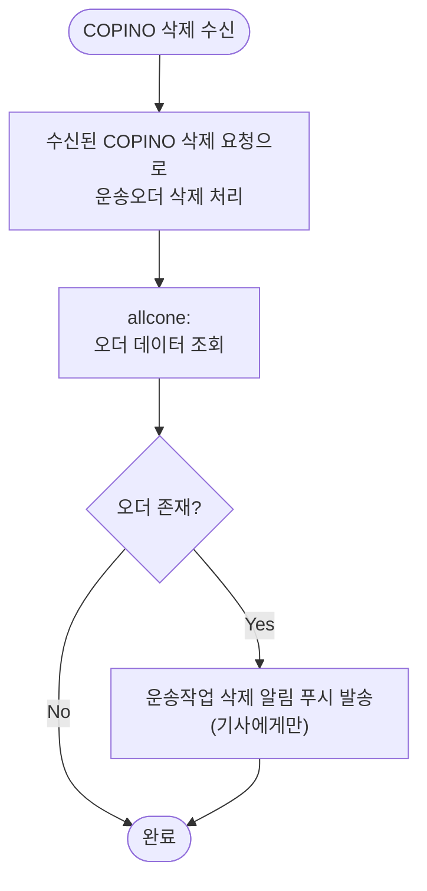

# COPINO 삭제 (RemoveCopino)

## 개요

TOS에서 COPINO 철회 → TA → BaaS → bctrans에 invoke alarm.
bctrans에서 운송오더 삭제 처리 → allcone에서 삭제 알림 FCM 푸시 발송.

## 전체 프로세스 플로우

```mermaid


flowchart TD
    START(["COPINO 삭제 수신"]) --> REMOVE["수신된 COPINO 삭제 요청으로
    운송오더 삭제 처리"]

    REMOVE --> AC_QUERY["allcone:
    오더 데이터 조회"]

    AC_QUERY --> AC_EXIST{"오더 존재?"}
    AC_EXIST -->|No| DONE(["종료"])
    AC_EXIST -->|Yes| PUSH["운송작업 삭제 알림 푸시 발송
    (기사에게만)"]
    PUSH --> DONE(["완료"])
```
