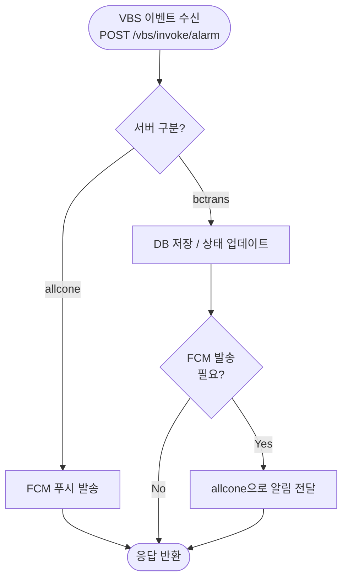
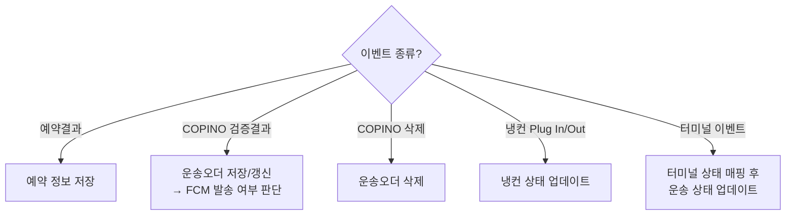

# VBS Invoke Alarm - 공통 진입점

## 개요

BaaS에서 VBS(EDI망) 이벤트 발생 시 `POST /vbs/invoke/alarm`으로 호출.
serverName에 따라 bctrans(DB 처리) → allcone(FCM 푸시) 순서로 분기.

## 진입 분기

```mermaid
flowchart TD
    START(["VBS 이벤트 수신
    POST /vbs/invoke/alarm"]) --> SERVER{"서버 구분?"}

    SERVER -->|"allcone"| AC["FCM 푸시 발송"]
    AC --> OK

    SERVER -->|"bctrans"| BC["DB 저장 / 상태 업데이트"]
    BC --> NEED{"FCM 발송
    필요?"}
    NEED -->|Yes| SEND["allcone으로 알림 전달"]
    NEED -->|No| OK
    SEND --> OK

    OK(["응답 반환"])
```

## 이벤트별 처리 분기

```mermaid


flowchart TD
    EVENT{"이벤트 종류?"}

    EVENT -->|"예약결과"| RSV["예약 정보 저장"]
    EVENT -->|"COPINO 검증결과"| CPV["운송오더 저장/갱신
    → FCM 발송 여부 판단"]
    EVENT -->|"COPINO 삭제"| RMV["운송오더 삭제"]
    EVENT -->|"냉컨 Plug In/Out"| RFR["냉컨 상태 업데이트"]
    EVENT -->|"터미널 이벤트"| TRM["터미널 상태 매핑 후
    운송 상태 업데이트"]
```
