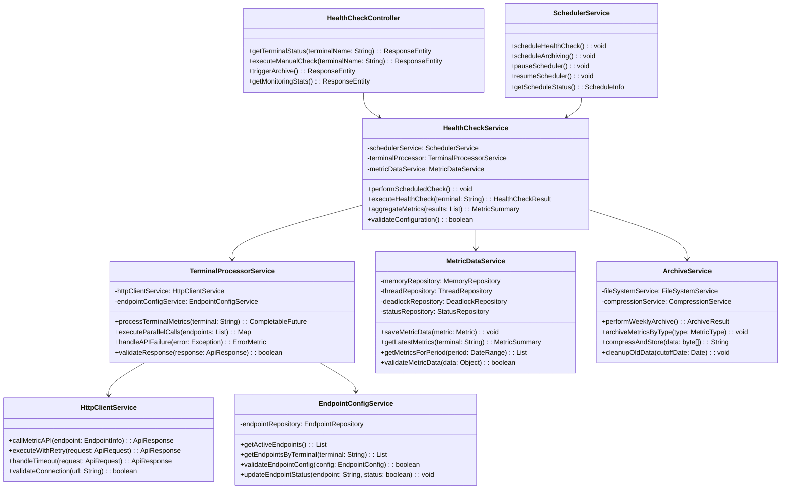
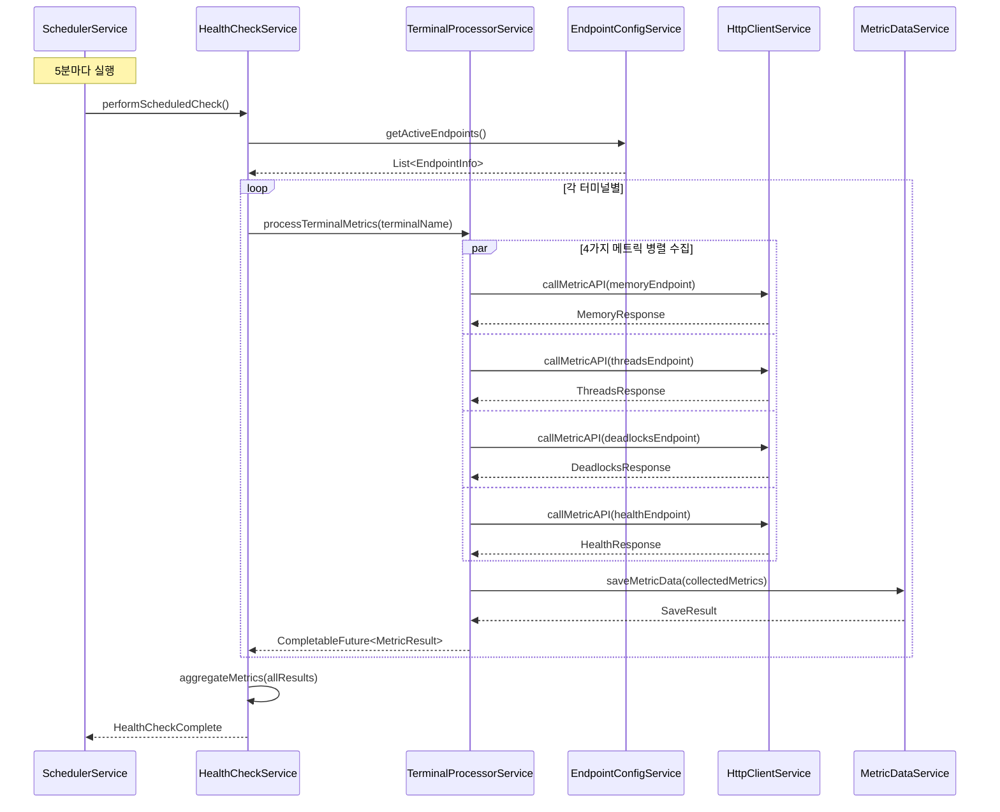
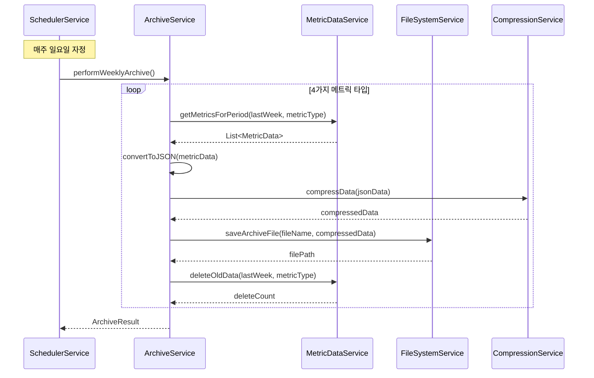
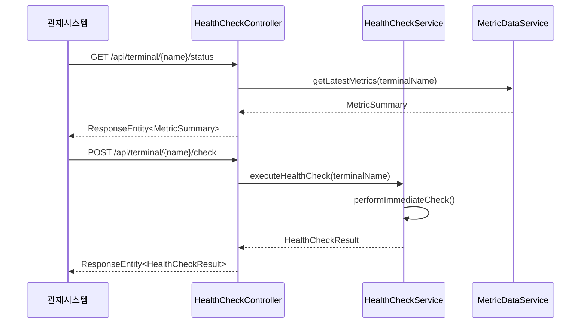

# 1.1. 모듈별 상세 설계

## 1.1.1. 서버 리소스 모니터링 모듈

### 1. 모듈 개요

|항목|내용|
|---|---|
|**모듈명**|서버 리소스 모니터링 모듈|
|**목적**|터미널별 서버 리소스 상태 실시간 모니터링 및 데이터 관리|
|**주요 기능**|• 5분 주기 헬스체크 수행<br>• 4가지 메트릭 수집 (Memory, Threads, Deadlocks, Health)<br>• 주간 데이터 아카이빙<br>• 관제시스템 API 제공|
|**기술 스택**|Spring Boot, MariaDB, Scheduler|

### 2. 아키텍처 설계

#### 2.1 계층 구조

```
┌─────────────────────────────────────┐
│           Presentation Layer        │  ← Controller (API)
├─────────────────────────────────────┤
│           Business Layer            │  ← Service (비즈니스 로직)
├─────────────────────────────────────┤
│           Data Access Layer         │  ← Repository (데이터 접근)
├─────────────────────────────────────┤
│           Infrastructure Layer      │  ← 외부 API, Scheduler
└─────────────────────────────────────┘
```

#### 2.2 컴포넌트 구성도

```
┌──────────────────┐    ┌──────────────────┐    ┌──────────────────┐
│   Scheduler      │───▶│  HealthCheck     │───▶│  Metric Data     │
│   Component      │    │  Service         │    │  Service         │
└──────────────────┘    └──────────────────┘    └──────────────────┘
                                │                        │
┌──────────────────┐    ┌──────────────────┐    ┌──────────────────┐
│   Archive        │◀───│  Terminal        │───▶│  HTTP Client     │
│   Service        │    │  Processor       │    │  Service         │
└──────────────────┘    └──────────────────┘    └──────────────────┘
```

### 3. 클래스 다이어그램



### 4. 시퀀스 다이어그램

#### 4.1 5분 주기 헬스체크 실행



#### 4.2 주간 아카이브 실행



#### 4.3 관제시스템 API 호출



### 5. 데이터 흐름도

```
터미널 API ──┐
             ├─► TerminalProcessor ──► MetricDataService ──► Database
터미널 API ──┘                                              │
                                                            ▼
SchedulerService ──► ArchiveService ──────────────────► File System
                                                            │
관제시스템 ◄─── HealthCheckController ◄─────────────────────┘
```