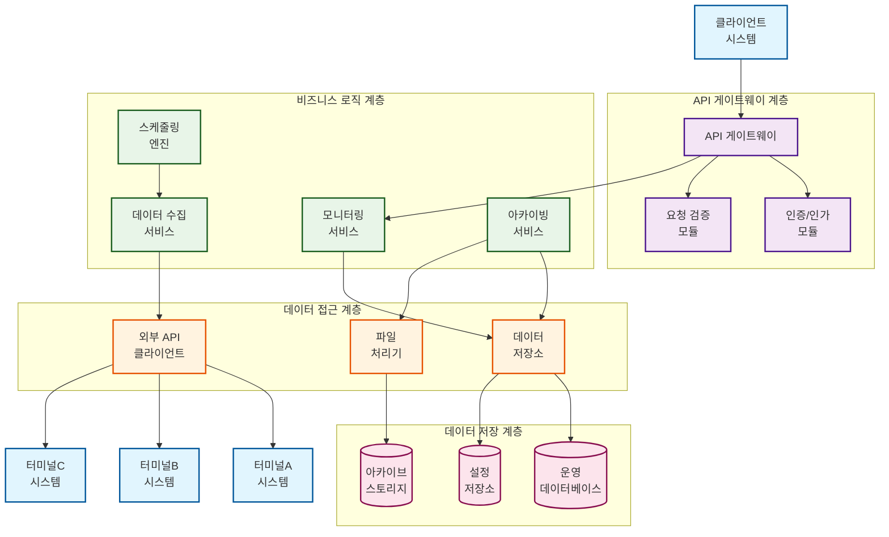
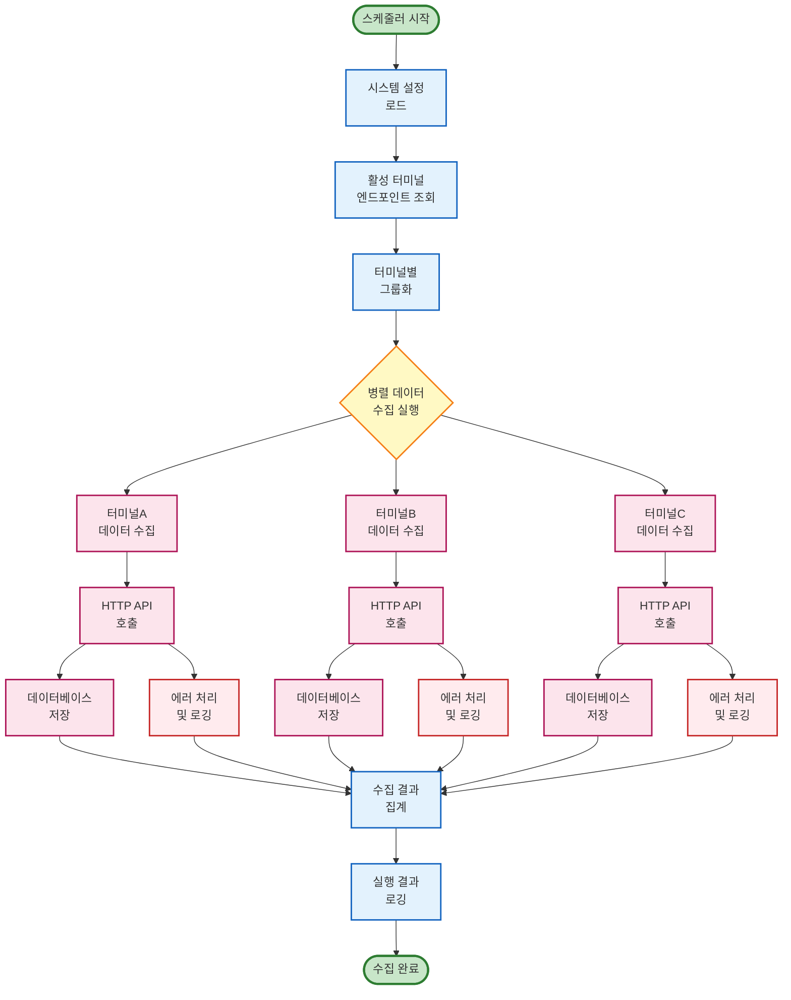
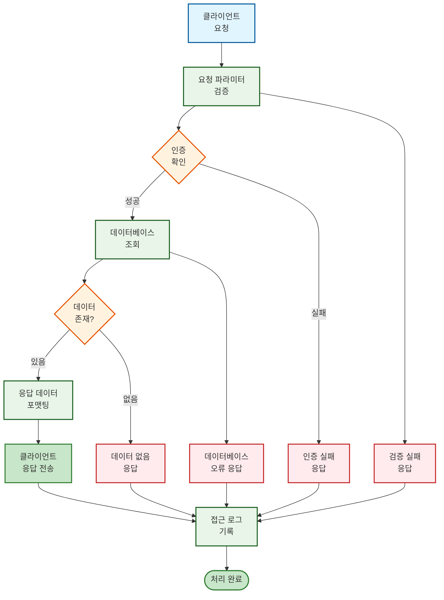
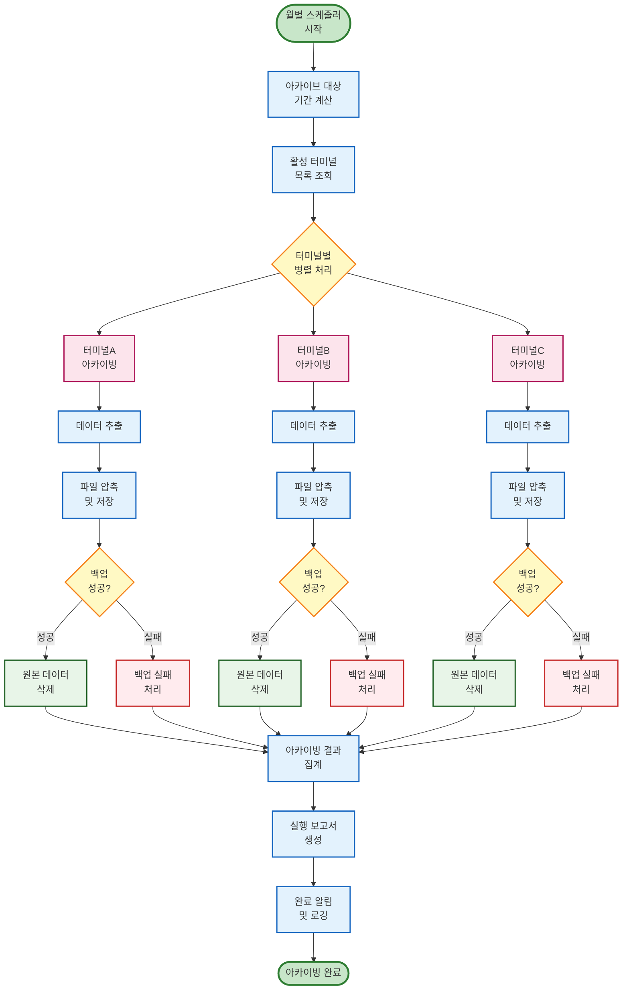

# 터미널 모니터링 시스템 설계 문서

## 1. 시스템 개요

본 시스템은 다중 터미널의 리소스 상태(메모리, 스레드, 데드락) 및 헬스 상태를 실시간으로 수집, 저장, 조회하는 백엔드 모니터링 시스템입니다. 주기적인 데이터 수집과 장기 보관을 위한 아카이빙 기능을 제공합니다.

## 2. 예상 컴포넌트 구조도

### 2.1 시스템 아키텍처 개요

본 시스템은 계층형 아키텍처를 기반으로 하며, 각 계층은 명확한 책임을 가지고 독립적으로 동작합니다.

- **API 게이트웨이 계층**: 외부 클라이언트 요청 처리 및 인증/인가
- **비즈니스 로직 계층**: 데이터 수집, 처리, 아카이빙 로직
- **데이터 접근 계층**: 데이터베이스 및 외부 API 통신
- **데이터 저장 계층**: 실시간 데이터 저장 및 아카이브 저장소

### 2.2 컴포넌트 구조도

### 2.3 컴포넌트 설명

#### API 게이트웨이 계층
- **API 게이트웨이**: 모든 외부 요청의 진입점, 라우팅 및 로드밸런싱
- **인증/인가 모듈**: 클라이언트 인증 및 권한 검증
- **요청 검증 모듈**: 입력 데이터 유효성 검사 및 스키마 검증

#### 비즈니스 로직 계층
- **스케줄링 엔진**: 주기적 작업 관리 (데이터 수집, 아카이빙)
- **데이터 수집 서비스**: 터미널별 리소스 정보 수집 및 처리
- **모니터링 서비스**: 실시간 상태 조회 및 알림 처리
- **아카이빙 서비스**: 장기 데이터 보관 및 압축 처리

#### 데이터 접근 계층
- **외부 API 클라이언트**: 터미널 시스템과의 HTTP 통신
- **데이터 저장소**: 데이터베이스 추상화 및 CRUD 연산
- **파일 처리기**: 아카이브 파일 생성, 압축, 관리

#### 데이터 저장 계층
- **운영 데이터베이스**: 실시간 모니터링 데이터 저장
- **아카이브 스토리지**: 장기 보관용 압축 파일 저장
- **설정 저장소**: 터미널 엔드포인트 및 시스템 설정

## 3. 예상 데이터 흐름도

### 3.1 데이터 수집 흐름

시스템의 핵심인 데이터 수집은 주기적으로 실행되며, 다중 터미널로부터 병렬로 데이터를 수집합니다.

### 3.2 데이터 조회 흐름

클라이언트의 조회 요청에 대한 실시간 응답 처리 흐름입니다.

### 3.3 아카이빙 흐름

장기 데이터 보관을 위한 월별 아카이빙 처리 흐름입니다.

## 4. 설계 특징

### 4.1 확장성
- 모듈형 아키텍처로 새로운 터미널 추가 시 설정만 변경
- 메트릭 타입 확장 가능한 구조
- 마이크로서비스 아키텍처 적용 가능

### 4.2 안정성
- 각 터미널별 독립적 처리로 장애 격리
- 다단계 에러 처리 및 복구 메커니즘
- 백업 검증 후 원본 삭제하는 안전한 아카이빙

### 4.3 성능
- 병렬 처리를 통한 수집 성능 최적화
- 비동기 I/O 활용한 고성능 API 서버
- 인덱스 최적화된 데이터베이스 설계

### 4.4 운영성
- 구조화된 로깅 시스템
- 실시간 모니터링 및 알림 지원
- 자동화된 아카이빙 및 데이터 관리