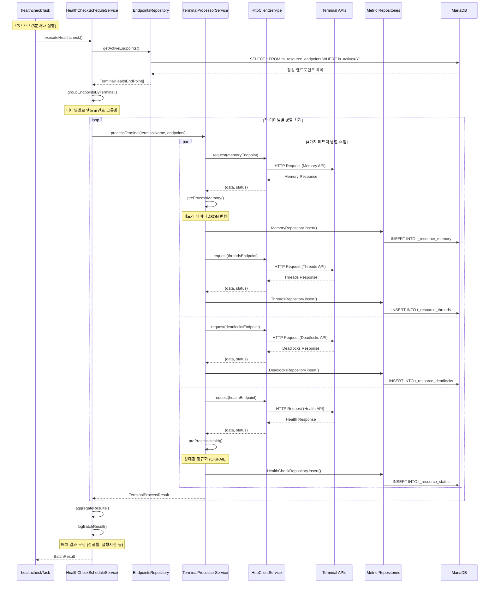
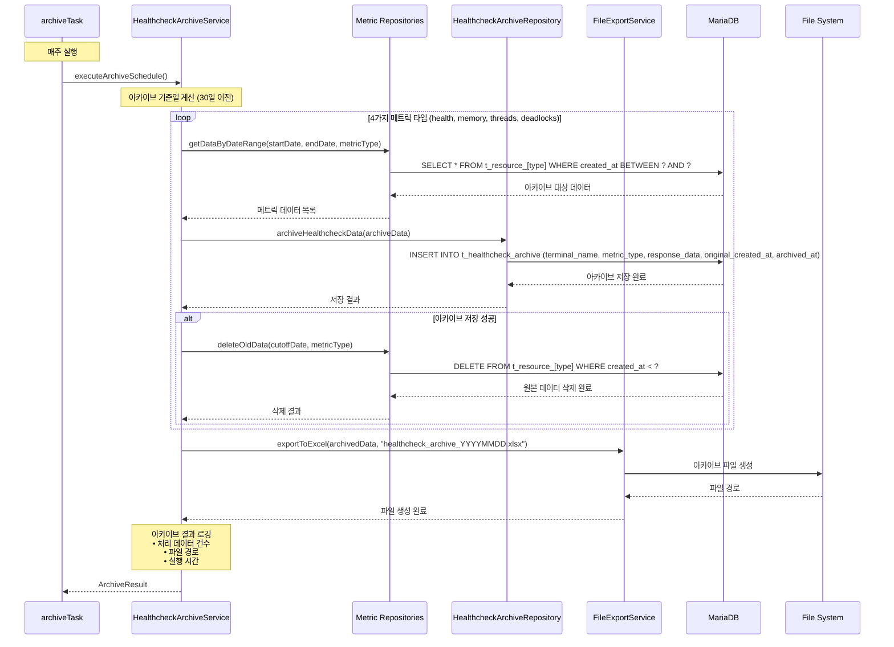
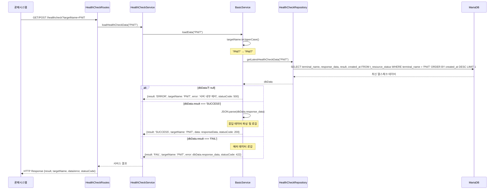

# 1.1. 모듈별 상세 설계

## 1.1.1. 서버 리소스 모니터링 모듈

### 1. 모듈 개요

| 항목        | 내용                                                                                                      |
| --------- | ------------------------------------------------------------------------------------------------------- |
| **모듈명**   | 서버 리소스 모니터링 모듈                                                                                          |
| **목적**    | 터미널별 서버 리소스 상태 실시간 모니터링 및 데이터 관리                                                                        |
| **주요 기능** | • 5분 주기 헬스체크 수행<br>• 4가지 메트릭 수집 (Memory, Threads, Deadlocks, Health)<br>• 주간 데이터 아카이빙<br>• 관제시스템 API 제공 |
| **기술 스택** | Node.js, Fastify, TypeScript, MariaDB, Cron Scheduler                                                   |

### 2. 아키텍처 설계

#### 2.1 계층 구조

```
┌─────────────────────────────────────┐
│           API Layer                 │  ← Routes (REST API)
├─────────────────────────────────────┤
│           Service Layer             │  ← Services (비즈니스 로직)
├─────────────────────────────────────┤
│           Repository Layer          │  ← Repositories (데이터 접근)
├─────────────────────────────────────┤
│           Infrastructure Layer      │  ← HTTP Client, Scheduler
└─────────────────────────────────────┘
```

#### 2.2 컴포넌트 구성도

```
┌──────────────────┐    ┌──────────────────┐    ┌──────────────────┐
│   Scheduler      │───▶│  HealthCheck     │───▶│  Terminal        │
│   (5분마다)      │    │  Schedule Svc    │    │  Processor Svc   │
└──────────────────┘    └──────────────────┘    └──────────────────┘
                                │                        │
┌──────────────────┐    ┌──────────────────┐    ┌──────────────────┐
│   Archive        │◀───│  Endpoints       │───▶│  HTTP Client     │
│   Service        │    │  Repository      │    │  Service         │
└──────────────────┘    └──────────────────┘    └──────────────────┘
```

### 3. 클래스 다이어그램

```mermaid
classDiagram
    %% API Layer
    class HealthCheckRoutes {
        +GET /healthcheck: getHealthCheckData()
        +POST /healthcheck: getHealthCheckData()
        -fastify: FastifyInstance
        -services: ServiceContainer
    }
    
    class MemoryRoutes {
        +GET /memory: getMemoryData()
        +POST /memory: getMemoryData()
        -fastify: FastifyInstance
        -services: ServiceContainer
    }
    
    class ThreadsRoutes {
        +GET /threads: getThreadsData()
        +POST /threads: getThreadsData()
        -fastify: FastifyInstance
        -services: ServiceContainer
    }
    
    class DeadLocksRoutes {
        +GET /deadlocks: getDeadlockData()
        +POST /deadlocks: getDeadlockData()
        +POST /alarm/deadlocks: insertAlarmData()
        -fastify: FastifyInstance
        -services: ServiceContainer
    }

    %% Service Layer (비즈니스 로직)
    class HealthCheckScheduleService {
        -endpointsRepo: EndpointsRepository
        -terminalProcessor: TerminalProcessorService
        -fastify: FastifyInstance
        +executeHealthcheck(terminalName?: string): Promise~BatchResult~
        -groupEndpointsByTerminal(endpoints): Map
        -aggregateResults(results, totalEndpoints, startTime): BatchResult
        -logBatchResult(result): void
        -createEmptyBatchResult(): BatchResult
    }

    class TerminalProcessorService {
        -httpClient: HttpClientService
        -memoryRepo: MemoryRepository
        -threadsRepo: ThreadsRepository
        -deadlocksRepo: DeadlocksRepository
        -healthCheckRepo: HealthCheckRepository
        -fastify: FastifyInstance
        +processTerminal(terminalName, endpoints): Promise~TerminalProcessResult~
        -processEndpoint(endpoint): Promise~HealthcheckResult~
        -saveResponse(endpoint, responseData, httpStatus): Promise~void~
        -preProcessMemory(terminalName, responseData, success): void
        -preProcessHealth(responseData, success): string
    }

    class HttpClientService {
        -timeout: number = 30000
        -fastify: FastifyInstance
        +request(endpoint): Promise~{data, status}~
        -buildHeaders(endpoint): Record~string, string~
        -executeRequest(config, endpoint): Promise~{data, status}~
    }

    class BasicService {
        <<abstract>>
        #fastify: FastifyInstance
        #repository: Repository
        +loadData(targetName: string): Promise~ServiceResult~
        #{abstract} fetchData(repository, target): Promise~any~
    }

    class HealthCheckService {
        -repository: HealthCheckRepository
        +loadHealthCheckData(targetName): Promise~ServiceResult~
        #fetchData(repository, target): Promise~RowDataSchema~
    }

    class MemoryService {
        -repository: MemoryRepository
        +loadMemoryData(targetName): Promise~ServiceResult~
        #fetchData(repository, target): Promise~RowDataSchema~
    }

    class ThreadsService {
        -repository: ThreadsRepository
        +loadThreadsData(targetName): Promise~ServiceResult~
        #fetchData(repository, target): Promise~RowDataSchema~
    }

    class DeadlocksService {
        -repository: DeadlocksRepository
        +loadDeadlockData(targetName): Promise~ServiceResult~
        +insertData(terminalName, data, httpStatus): Promise~ServiceResult~
        #fetchData(repository, target): Promise~RowDataSchema~
    }

    %% Repository Layer
    class EndpointsRepository {
        -healthEndpointsTableName: "m_resource_endpoints"
        -fastify: FastifyInstance
        +getActiveEndpoints(): Promise~TerminalHealthEndPoint[]~
        +getActiveEndpointsByTerminal(terminalName): Promise~TerminalHealthEndPoint[]~
    }

    class HealthCheckRepository {
        -tableName: "t_resource_status"
        -db: Pool
        -fastify: FastifyInstance
        +getLatestHealthCheckData(targetName): Promise~RowDataSchema~
        +insert(terminalName, responseData, httpStatus): Promise~void~
        +getByTerminal(terminalName, limit): Promise~RowDataPacket[]~
    }

    class MemoryRepository {
        -tableName: "t_resource_memory"
        -db: Pool
        -fastify: FastifyInstance
        +getLatestMemoryData(targetName): Promise~RowDataSchema~
        +insert(terminalName, responseData, httpStatus): Promise~void~
        +getByTerminal(terminalName, limit): Promise~RowDataPacket[]~
    }

    class ThreadsRepository {
        -tableName: "t_resource_threads"
        -db: Pool
        -fastify: FastifyInstance
        +getLatestThreadsData(targetName): Promise~RowDataSchema~
        +insert(terminalName, responseData, httpStatus): Promise~void~
        +getByTerminal(terminalName, limit): Promise~RowDataPacket[]~
    }

    class DeadlocksRepository {
        -tableName: "t_resource_deadlocks"
        -db: Pool
        -fastify: FastifyInstance
        +getLatestDeadlockData(targetName): Promise~RowDataSchema~
        +insert(terminalName, responseData, httpStatus): Promise~void~
        +getByTerminal(terminalName, limit): Promise~RowDataPacket[]~
    }

    %% Archive Services
    class HealthcheckArchiveService {
        -archiveRepo: HealthcheckArchiveRepository
        -fastify: FastifyInstance
        +executeArchiveSchedule(): Promise~void~
        +archiveHealthcheckData(startDate, endDate): Promise~ArchiveResult~
        +getArchivedData(dateRange): Promise~ArchiveData[]~
    }

    class FileExportService {
        +exportToExcel(data, filename): Promise~string~
        +exportToCSV(data, filename): Promise~string~
        +generateReport(data, format): Promise~Buffer~
    }

    %% Relationships
    HealthCheckRoutes --> HealthCheckService
    MemoryRoutes --> MemoryService
    ThreadsRoutes --> ThreadsService
    DeadLocksRoutes --> DeadlocksService

    BasicService <|-- HealthCheckService
    BasicService <|-- MemoryService
    BasicService <|-- ThreadsService
    BasicService <|-- DeadlocksService

    HealthCheckService --> HealthCheckRepository
    MemoryService --> MemoryRepository
    ThreadsService --> ThreadsRepository
    DeadlocksService --> DeadlocksRepository

    HealthCheckScheduleService --> EndpointsRepository
    HealthCheckScheduleService --> TerminalProcessorService
    TerminalProcessorService --> HttpClientService
    TerminalProcessorService --> HealthCheckRepository
    TerminalProcessorService --> MemoryRepository
    TerminalProcessorService --> ThreadsRepository
    TerminalProcessorService --> DeadlocksRepository

    HealthcheckArchiveService --> FileExportService
```

### 4. 시퀀스 다이어그램

#### 4.1 5분 주기 헬스체크 실행



#### 4.2 주간 아카이브 실행



#### 4.3 관제시스템 API 호출



### 5. 데이터 흐름도

```
터미널 Memory API ──┐
터미널 Threads API ─┤
터미널 Deadlocks API ┼─► HttpClientService ──► TerminalProcessorService ──► MetricRepositories ──► MariaDB
터미널 Health API ──┘                                                                                    │
                                                                                                          ▼
Scheduler (5분마다) ──► HealthCheckScheduleService ──────────────────────────────────────────────► Archive Service
                                                                                                          │
                                                                                                          ▼
관제시스템 ◄─── HealthCheckRoutes ◄─── HealthCheckService ◄─── BasicService ◄─────────────────────── File System
```

### 6. 데이터베이스 설계

#### 6.1 주요 테이블 구조

|테이블명|용도|주요 컬럼|
|---|---|---|
|**m_resource_endpoints**|모니터링 엔드포인트 마스터|terminal_name, metric_type, api_url, api_key, is_active|
|**t_resource_status**|헬스체크 이력|terminal_name, response_data, result, created_at|
|**t_resource_memory**|메모리 사용률 이력|terminal_name, response_data, result, created_at|
|**t_resource_threads**|스레드 상태 이력|terminal_name, response_data, result, created_at|
|**t_resource_deadlocks**|데드락 이력|terminal_name, response_data, result, created_at|
|**t_healthcheck_archive**|아카이브 데이터|terminal_name, metric_type, response_data, original_created_at, archived_at|

#### 6.2 데이터 보존 정책

|데이터 유형|보존 기간|아카이브 주기|
|---|---|---|
|**실시간 메트릭 데이터**|30일|주간|
|**아카이브 데이터**|1년|월간 압축|
|**로그 데이터**|90일|일간 로테이션|

### 7. API 명세

#### 7.1 헬스체크 조회 API

|항목|내용|
|---|---|
|**엔드포인트**|`GET/POST /api/healthcheck`|
|**파라미터**|targetName (터미널명)|
|**응답 형태**|`{result: string, targetName: string, data: object, statusCode: number}`|
|**HTTP 상태코드**|200 (성공), 422 (실패), 500 (에러)|

#### 7.2 메트릭별 조회 API

|메트릭 타입|엔드포인트|기능|
|---|---|---|
|**Memory**|`GET/POST /api/memory`|메모리 사용률 조회|
|**Threads**|`GET/POST /api/threads`|스레드 상태 조회|
|**Deadlocks**|`GET/POST /api/deadlocks`|데드락 상태 조회|
|**Deadlock Alarm**|`POST /api/alarm/deadlocks`|데드락 알람 직접 전송|

### 8. 성능 및 모니터링

#### 8.1 성능 지표

|지표|목표값|모니터링 방법|
|---|---|---|
|**API 응답시간**|< 3초|로그 기반 측정|
|**배치 실행시간**|< 2분|스케줄러 로그|
|**데이터베이스 연결**|> 95% 가용성|헬스체크|
|**메모리 사용률**|< 80%|시스템 모니터링|

#### 8.2 에러 처리

|에러 유형|처리 방법|복구 전략|
|---|---|---|
|**외부 API 타임아웃**|30초 후 실패 처리|다음 스케줄에서 재시도|
|**데이터베이스 연결 실패**|연결 풀 재생성|자동 재연결|
|**메모리 부족**|가비지 컬렉션|프로세스 재시작|
|**디스크 공간 부족**|아카이브 정리|알람 발송|

### 9. 배포 및 운영

#### 9.1 배포 환경

|환경|목적|특징|
|---|---|---|
|**개발(DEV)**|개발 및 단위 테스트|Mock API 사용|
|**스테이징(STG)**|통합 테스트|실제 터미널 연동|
|**운영(PROD)**|실서비스|고가용성 구성|

#### 9.2 모니터링 대시보드

- **실시간 메트릭**: 터미널별 상태 현황
- **배치 실행 상태**: 성공률, 실행시간
- **시스템 리소스**: CPU, 메모리, 디스크 사용률
- **알람 현황**: 장애 발생 시 즉시 알림
