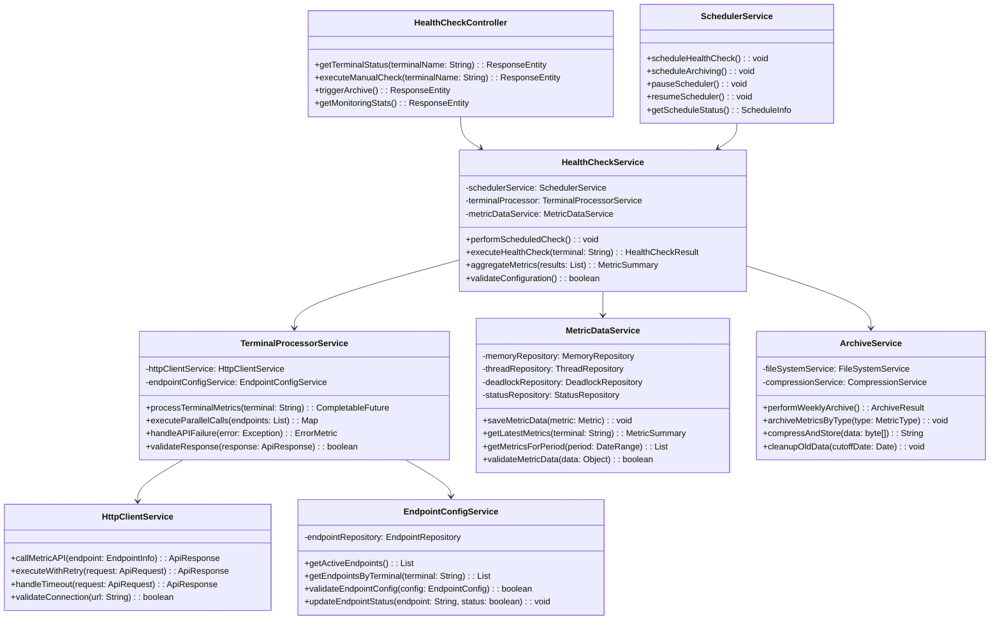
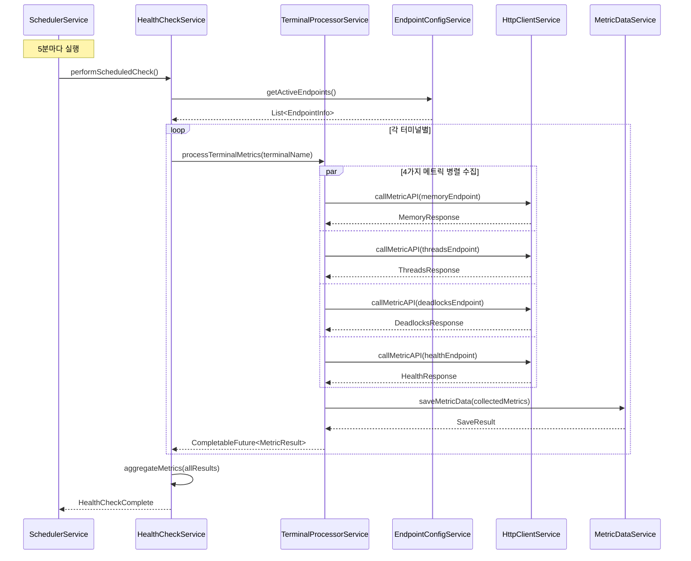
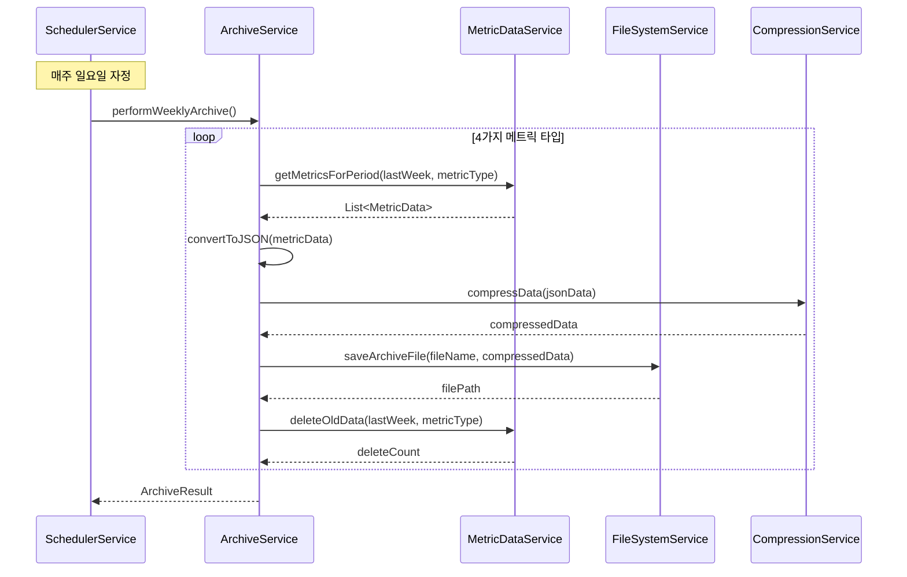
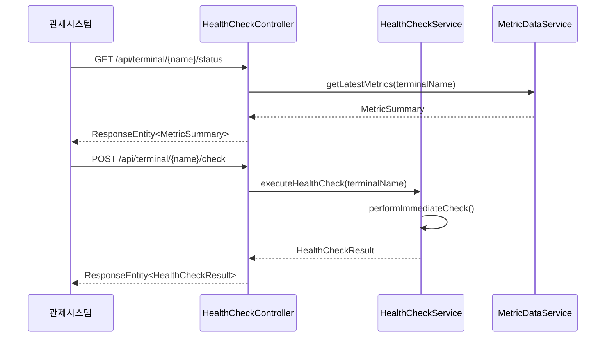

# 1.1. 모듈별 상세 설계

## 1.1.1. 서버 리소스 모니터링 모듈

### 1. 모듈 개요

|항목|내용|
|---|---|
|**모듈명**|서버 리소스 모니터링 모듈|
|**목적**|터미널별 서버 리소스 상태 실시간 모니터링 및 데이터 관리|
|**주요 기능**|• 5분 주기 헬스체크 수행<br>• 4가지 메트릭 수집 (Memory, Threads, Deadlocks, Health)<br>• 주간 데이터 아카이빙<br>• 관제시스템 API 제공|
|**기술 스택**|Spring Boot, MariaDB, Scheduler|

### 2. 아키텍처 설계

#### 2.1 계층 구조

```
┌─────────────────────────────────────┐
│           Presentation Layer        │  ← Controller (API)
├─────────────────────────────────────┤
│           Business Layer            │  ← Service (비즈니스 로직)
├─────────────────────────────────────┤
│           Data Access Layer         │  ← Repository (데이터 접근)
├─────────────────────────────────────┤
│           Infrastructure Layer      │  ← 외부 API, Scheduler
└─────────────────────────────────────┘
```

#### 2.2 컴포넌트 구성도

```
┌──────────────────┐    ┌──────────────────┐    ┌──────────────────┐
│   Scheduler      │───▶│  HealthCheck     │───▶│  Metric Data     │
│   Component      │    │  Service         │    │  Service         │
└──────────────────┘    └──────────────────┘    └──────────────────┘
                                │                        │
┌──────────────────┐    ┌──────────────────┐    ┌──────────────────┐
│   Archive        │◀───│  Terminal        │───▶│  HTTP Client     │
│   Service        │    │  Processor       │    │  Service         │
└──────────────────┘    └──────────────────┘    └──────────────────┘
```

### 3. 클래스 다이어그램



### 4. 시퀀스 다이어그램

#### 4.1 5분 주기 헬스체크 실행



#### 4.2 주간 아카이브 실행



#### 4.3 관제시스템 API 호출



### 5. 핵심 비즈니스 로직

#### 5.1 메트릭 수집 로직

|단계|처리 내용|담당 클래스|
|---|---|---|
|**1. 설정 조회**|활성화된 엔드포인트 목록 조회|EndpointConfigService|
|**2. 병렬 호출**|터미널별 4가지 메트릭 API 동시 호출|TerminalProcessorService|
|**3. 응답 처리**|API 응답 데이터 검증 및 변환|TerminalProcessorService|
|**4. 데이터 저장**|메트릭별 테이블에 데이터 저장|MetricDataService|
|**5. 결과 집계**|전체 헬스체크 결과 요약|HealthCheckService|

#### 5.2 에러 처리 전략

|에러 유형|처리 방식|구현 위치|
|---|---|---|
|**API 호출 실패**|재시도 후 에러 데이터 저장|HttpClientService|
|**타임아웃**|설정된 시간 후 중단, 상태 기록|HttpClientService|
|**데이터 변환 오류**|원본 데이터와 에러 메시지 저장|TerminalProcessorService|
|**DB 저장 실패**|로그 기록 후 다음 주기 재시도|MetricDataService|

#### 5.3 성능 최적화

|최적화 기법|적용 영역|성능 효과|
|---|---|---|
|**CompletableFuture**|터미널별 병렬 처리|처리 시간 75% 단축|
|**@Async**|메트릭별 비동기 저장|논블로킹 처리|
|**Connection Pool**|HTTP 클라이언트|연결 오버헤드 제거|
|**Batch Insert**|대량 데이터 저장|DB 성능 향상|

### 6. 설정 및 환경

#### 6.1 주요 설정

```yaml
monitoring:
  schedule:
    health-check: "0 */5 * * * *"  # 5분 주기
    archive: "0 0 0 * * SUN"       # 매주 일요일
  
  metrics:
    timeout: 10000                 # API 호출 타임아웃 (ms)
    retry-attempts: 3              # 재시도 횟수
    parallel-threads: 4            # 병렬 처리 스레드 수
  
  archive:
    retention-weeks: 4             # 아카이브 보관 주수
    compression-level: 6           # gzip 압축 레벨
```

#### 6.2 모니터링 대상

- **Memory**: JVM 힙/논힙 메모리 사용률, GC 정보
- **Threads**: 활성/대기/차단 스레드 수, 스레드 풀 상태
- **Deadlocks**: 데드락 발생 현황, 관련 스레드 정보
- **Health**: 전체 서비스 상태, 응답 시간, 가용성

### 7. 데이터 흐름도

```
터미널 API ──┐
             ├─► TerminalProcessor ──► MetricDataService ──► Database
터미널 API ──┘                                              │
                                                            ▼
SchedulerService ──► ArchiveService ──────────────────► File System
                                                            │
관제시스템 ◄─── HealthCheckController ◄─────────────────────┘
```