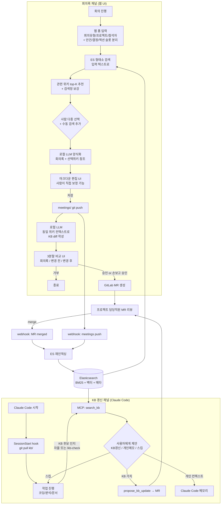

# AX 세미나 플랫폼 — 전체 흐름

> 사내위키 + 회의록 통합 KB 플랫폼. v0.3 (2026-05-27)
> v0.1 초안 → 대화 검토 후 오버엔지니어링 걷어낸 확정 안.

---

## 0. 액터 & 시스템 구성요소

| 구분 | 요소 | 역할 |
|------|------|------|
| 사람 | 회의 작성자 | 웹 폼 입력, 관련 위키 다중 선택, 양식화 결과 편집, KB 변경안 확인 |
| 사람 | 개발자/분석가 | Claude Code 작업 중 KB 갱신 제안 검토·승인 |
| 사람 | 프로젝트 담당직원 | KB MR 최종 컨펌 (영역별 CODEOWNERS) |
| 클라이언트 | 웹 UI | 회의록 입력 폼 + 마크다운 편집기 + 3분할 비교 UI |
| 클라이언트 | Claude Code | SessionStart hook + MCP 호출 |
| 서버 | MCP KB 서버 | 3개 도구 노출 |
| 서버 | 로컬 LLM (Qwen2.5-32B) | 양식화 + KB diff 작성 (자유 판단 X, 제약된 변환만) |
| 서버 | webhook 핸들러 | GitLab 이벤트 수신 → ES 인덱싱 (단일 프로세스, DGX Spark) |
| 저장소 | GitLab `meetings/` | 회의록 본문 (작성자 직접 push) |
| 저장소 | GitLab `kb/` | KB 본문 (MR + 담당직원 컨펌 only) |
| 저장소 | Elasticsearch | BM25 + dense_vector + 메타데이터 (단일 검색 저장소) |

---

## 1. 전체 흐름 한 장


```mermaid
flowchart TB
    subgraph 회의록채널["회의록 채널 (웹 UI)"]
        A1[회의 진행] --> A2[웹 폼 입력<br/>회의유형/프로젝트/참석자<br/>+ 안건/결정/액션 슬롯 분리]
        A2 --> A3[ES 형태소 검색<br/>입력 텍스트로]
        A3 --> A4[관련 위키 top-K 추천<br/>+ 검색창 보강]
        A4 --> A5{사람 다중 선택<br/>+ 수동 검색 추가}
        A5 --> A6[로컬 LLM 양식화<br/>회의록 + 선택위키 참조]
        A6 --> A7[마크다운 편집 UI<br/>사람이 직접 보정 가능]
        A7 -- 저장 --> A8[meetings/ git push]
        A8 --> A9[로컬 LLM<br/>동일 위키 컨텍스트로<br/>KB diff 작성]
        A9 --> A10[3분할 비교 UI<br/>회의록 / 변경 전 / 변경 후]
        A10 -- 거부 --> END1[종료]
        A10 -- 승인 or 손보고 승인 --> A11[GitLab MR 생성]
    end

    subgraph KB채널["KB 갱신 채널 (Claude Code)"]
        B0[Claude Code 시작] --> B1[SessionStart hook<br/>git pull kb/]
        B1 --> B2[작업 진행<br/>코딩/분석/문서]
        B2 -- KB 후보 인지<br/>자율 또는 /kb-check --> B3[MCP: search_kb]
        B3 --> B4{사용자에게 제안<br/>KB갱신 / 개인메모 / 스킵}
        B4 -- KB 가치 --> B5[propose_kb_update → MR]
        B4 -- 개인 컨텍스트 --> B6[Claude Code 메모리]
        B4 -- 스킵 --> B2
    end

    A11 --> R[프로젝트 담당직원 MR 리뷰]
    B5 --> R
    R -- merge --> WH[webhook: MR merged]
    WH --> IDX[ES 재인덱싱]
    A8 --> WH2[webhook: meetings push]
    WH2 --> IDX

    IDX --> ES[(Elasticsearch<br/>BM25 + 벡터 + 메타)]
    ES --> A3
    ES --> B3
```

---

## 2. 회의록 채널 단계별

| # | 단계 | 액터 | 입력 | 출력 | 트리거 |
|---|------|------|------|------|--------|
| 1 | 회의 진행 | 사람 | - | 회의 내용 | - |
| 2 | 웹 폼 입력 | 작성자 | 셀렉트박스(회의유형/프로젝트/참석자) + 안건/결정/액션 슬롯 | 정형 JSON | 회의 종료 |
| 3 | ES 검색 | 웹 → ES | 입력 텍스트 (특히 결정 슬롯) | 관련 위키 top-K | 폼 제출 |
| 4 | 위키 선택 | 작성자 | 추천 리스트 + 검색창 | 선택된 위키 ID 목록 (다중) | 검색 결과 도착 |
| 5 | LLM 양식화 | 웹 → 로컬 LLM | 회의록 + 선택 위키 본문 (읽기 전용 참조) | 양식화된 MD | 위키 선택 완료 |
| 6 | 편집기 보정 | 작성자 | 양식화 결과 | 보정된 최종 MD | 양식화 도착 |
| 7 | commit | 웹 백엔드 | 승인된 MD | `meetings/YYYY/MM/{slug}.md` push | 저장 |
| 8 | KB diff 작성 | 로컬 LLM | 정리 회의록(결정 슬롯) + 동일 위키 컨텍스트 | 위키별 diff (수정/신규) | push 이후 |
| 9 | 3분할 비교 검토 | 작성자 | 회의록 / 변경 전 위키 / 변경 후 제안 | 승인 or 수정 후 승인 | diff 도착 |
| 10 | MR 생성 | 웹 → GitLab API | 최종 diff + 사유 | MR URL | 작성자 승인 |
| 11 | 담당직원 컨펌 | 프로젝트 담당직원 | MR | merge or 수정요청 | MR 생성 |
| 12 | 색인 | webhook → 핸들러 | merged 이벤트 | ES 재인덱싱 | merge |

### 양식화 단계의 환각 차단 규칙 (5번 단계 프롬프트 제약)

```
선택된 위키 문서는 [참조용]이다. 다음 규칙을 반드시 지켜라:
- 위키에서 용어 표기·정의를 가져와 회의록 표현을 보정
- 회의록에 명시되지 않은 사실은 추가 금지
- 위키 내용을 회의록 결정사항인 것처럼 서술 금지
- 모호한 부분은 [확인필요] 마커로 남길 것
```

---

## 3. KB 갱신 채널 단계별 (Claude Code)

| # | 단계 | 액터 | 입력 | 출력 | 트리거 |
|---|------|------|------|------|--------|
| 1 | 세션 시작 | Claude Code | - | 로컬 `kb/` 최신화 | SessionStart hook |
| 2 | 작업 | 개발자 + Claude | 코드/문서/대화 | (작업물) | - |
| 3 | KB 후보 인지 | Claude (자율) or 사용자 (`/kb-check`) | 작업 컨텍스트 | "이 지식 KB에 있나/올릴 만한가" 판단 | 자율 휴리스틱 + 명시 호출 |
| 4 | 기존 KB 조회 | Claude → MCP `search_kb` | 키워드 | 하이브리드 검색 결과 | 후보 인지 |
| 5 | 사용자 제안 | Claude | 후보 + 기존 KB 비교 | 사용자 결정 | 조회 결과 |
| 6a | KB MR | Claude → MCP `propose_kb_update` | diff + 사유 + 대상 파일 | GitLab MR | "KB 가치" 선택 |
| 6b | 개인 메모리 | Claude → memory_user_edits | 메모 내용 | 저장 | "개인 컨텍스트" 선택 |
| 7 | 담당직원 컨펌 | 프로젝트 담당직원 | MR | merge or 수정요청 | MR 생성 |
| 8 | 색인 | webhook → 핸들러 | merged 이벤트 | ES 재인덱싱 | merge |

### 5번 단계의 분류 가이드

| 종류 | 저장소 | 예시 |
|------|--------|------|
| 팀 합의 지식 (용어, 인터페이스 정의, 도메인 규칙) | KB MR → `kb/` | "VBS는 신항/북항 공통 코드 체계로 통합한다" |
| 개인 작업 컨텍스트 (진행상황, 임시 가설) | Claude Code 메모리 | "지금 bctrans-api-v2 Handler 리팩토링 중" |
| 프로젝트 상태 (현재 작업) | `.review-context` 세션 상태 | "Builder/Reviewer 페어 마지막 결과" |

---

## 4. 채널 간 연결

두 채널은 *물리적으로 분리*되어 있으나 **GitLab MR이라는 단일 종착지로 수렴**한다. 회의록 채널이 자동 생성한 MR과 Claude Code가 생성한 MR이 같은 리뷰 큐에 들어가고, 같은 담당직원이 검토한다.

| 출처 | MR 라벨 | 검토자 |
|------|---------|--------|
| 회의록 채널 | `source:auto-meeting` + `project:{이름}` | 프로젝트 담당직원 |
| Claude Code | `source:claude-code` + `project:{이름}` | 프로젝트 담당직원 |
| common/ 변경 (출처 무관) | `scope:common` 추가 | CODEOWNERS 별도 그룹 |

**연결 책임 원칙**

- 로컬 LLM: *제약된 변환*만 수행 (양식화, diff 작성)
- 자유 판단(이게 KB 가치가 있는가?): 사람이 *반드시* 게이트
- LLM 메모리 자체에 도메인 지식 누적 금지 (GitLab이 단일 진실 원천)

---

## 5. 데이터 저장 구조

```
GitLab repo (단일 진실 원천)
├── meetings/
│   └── 2026/05/2026-05-27-팀회의.md      ← 작성자 직접 push
└── kb/
    ├── domain/glossary/                    ← 마크다운 (yaml 1회 마이그 후 폐기)
    ├── projects/{project-name}/
    └── common/

Elasticsearch (휘발 가능, GitLab에서 재인덱싱 가능)
├── kb_index            ← kb/ 본문 + BM25 + dense_vector + 메타
│   (doc_id, file_path, gitlab_url, category, embedding, body, ...)
├── meetings_index      ← meetings/ 본문 + BM25 + dense_vector + 메타
└── glossary_index      ← 용어집 (단일 SoT)
    (term, definition, aliases, category, ...)
```

PostgreSQL은 사용하지 않는다. 트랜잭션이 필요한 시나리오가 없고 원본은 GitLab에 있어 ES는 *검색 인덱스로 휘발 가능*하다.

---

## 6. MCP 도구

| 도구 | 입력 | 출력 | 호출자 |
|------|------|------|--------|
| `search_kb(query, top_k, filter?)` | 자연어 또는 형태소 | 하이브리드 검색 결과 (BM25 + 벡터 RRF) | 웹 / Claude Code |
| `get_document(doc_id)` | 문서 ID | 본문 + 메타 | 양 채널 |
| `propose_kb_update(diff, reason, target_files)` | 변경 diff + 사유 + 대상 | GitLab MR URL | Claude Code (사용자 승인 후) |

`search_kb` 한 도구로 정확 매칭(BM25)·의미 유사(벡터)·메타 필터까지 처리한다. 별도 `query_structured` 불필요.

---

## 7. 색인 트리거 정책

| 이벤트 | 처리 |
|--------|------|
| `meetings/` push | ES 인덱싱 (즉시) |
| `kb/` MR merged | ES 재인덱싱 |
| `kb/` 직접 push (정책 위반) | 인덱싱 X + 슬랙 알림 |
| glossary 변경 | `kb/` 흐름에 통합 (별도 처리 X) |

webhook 핸들러는 단일 프로세스가 두 이벤트를 모두 처리한다. 별도 색인 워커/큐 없음.

---

## 8. v0.1 → v0.3 주요 변경사항

| 항목 | v0.1 | v0.3 |
|------|------|------|
| 데이터 저장소 | PG + pgvector + ES 등 다층 | **ES 단일** |
| 로컬 LLM 역할 | 양식화 전담 (판단 X) | **양식화 + 제약된 diff 작성** (자유 판단 X 유지) |
| 위키 컨텍스트 활용 | 양식화 후 별도 단계 | **양식화부터 위키 참조** (환각 ↓, 용어 일관성 ↑) |
| 사람의 위키 선택 단계 | 없음 | **ES 추천 → 다중 선택 + 수동 검색** |
| 양식화 UI | diff(좌우 비교) | **마크다운 편집기** (회의록은 신규 생성이라 비교 무의미) |
| KB 변경 UI | 미정 | **3분할 비교** (회의록 / 변경 전 / 변경 후) |
| Reviewer LLM | 검토 중 | **제거** (사람 게이트로 대체) |
| Outbox/일일 cron | 검토 중 | **제거** (즉시 MR, 양이 적음) |
| MCP 도구 | 4개 | **3개** |
| MR 컨펌 | 팀장 단일 | **프로젝트 담당직원** + CODEOWNERS (common/) |
| 색인 워커 | 별도 프로세스 | **webhook 핸들러가 직접** |
| `meetings/` 트리거 | push vs MR 미정 | **push로 통일** |

---

## 9. 남은 결정 분기점

- [ ] **ES 점수 임계값 θ** — 초기엔 감으로 시작 (BM25 정상화 후 0.5 정도?) → 운영 데이터로 튜닝
- [ ] **CODEOWNERS 적용 범위** — common/만으로 시작 권장. 프로젝트별까지 확대는 운영 후 결정
- [ ] **glossary 마이그 시점** — YAML → ES glossary_index 1회 마이그, YAML 폐기
- [ ] **Claude Code의 KB 후보 인지 휴리스틱** — 자율 인지의 트리거 조건 (skill로 구현)
- [ ] **편집기 UI 라이브러리** — 마크다운 에디터 + 3분할 비교 컴포넌트 선택
- [ ] **DGX Spark 결재 명분** — 회의록 처리 단독으로는 약함. 슬랙 봇/인터페이스 추천 API 등 동반 워크로드 묶기

---

## 10. 한눈 점검 체크리스트

- [ ] ES 인덱스 스키마 확정 (kb_index, meetings_index, glossary_index)
- [ ] 양식화 프롬프트 환각 차단 규칙 검증 (테스트 회의록 N건)
- [ ] 3분할 비교 UI 프로토타입
- [ ] webhook 핸들러 단일 프로세스 구현 (인덱싱 + KB diff + MR)
- [ ] MCP 서버 3개 도구 구현
- [ ] Claude Code SessionStart hook 스크립트
- [ ] CODEOWNERS 파일 (`kb/common/`)
- [ ] MR 라벨 자동 적용 규칙

---

## 부록: 관련 메모리 / 문서

- 결정 이력: `~/.claude/projects/-mnt-d-workspace-bctrans-prod-api-bctrans-analyze/memory/project_platform_kb_meetings.md`
- 세미나 컨텍스트: 같은 디렉토리 `project_ax_seminar.md`
- 책임 분리 원칙: 같은 디렉토리 `feedback_responsibility_separation.md` (v0.3은 *자유 판단 금지·제약된 변환 허용*으로 재정의)
- v0.1 초안: 같은 문서 이전 버전