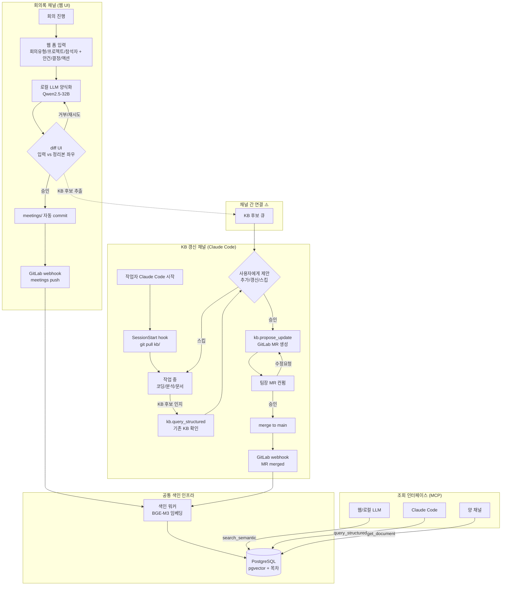

# AX 세미나 플랫폼 — 전체 흐름

> 한눈에 보고 바꿀 부분 찾기 위한 흐름 정리. v0.1 (2026-05-27)
> 결정 분기점은 ⚠️ 마커로 표시. 토론 후 갱신.

---

## 0. 액터 & 시스템 구성요소

| 구분 | 요소 | 역할 |
|------|------|------|
| 사람 | 회의 작성자 | 회의록 웹 폼 입력, LLM 정리본 검토 승인 |
| 사람 | 개발자/분석가 | Claude Code로 작업 중 KB 갱신 제안 검토 |
| 사람 | 팀장 | KB MR 컨펌 (회의록 commit은 컨펌 없음) |
| 클라이언트 | 웹 UI | 회의록 입력 폼 + diff UI |
| 클라이언트 | Claude Code | SessionStart hook + KB skill + MCP 호출 |
| 서버 | MCP KB 서버 | 4개 도구 노출 (search/query/get/propose) |
| 서버 | 로컬 LLM (Qwen2.5-32B) | 회의록 양식화 전담 (판단 X) |
| 서버 | 색인 워커 | BGE-M3 임베딩 → pgvector 적재 |
| 저장소 | GitLab `meetings/` | 회의록 본문 (작성자 직접 commit) |
| 저장소 | GitLab `kb/` | KB 본문 (MR + 컨펌 only) |
| 저장소 | PostgreSQL + pgvector | RDB(목차/용어사전) + 벡터 색인 |

---

## 1. 전체 흐름 한 장


```mermaid
flowchart TB
    subgraph 회의록채널["회의록 채널 (웹 UI)"]
        A1[회의 진행] --> A2[웹 폼 입력<br/>회의유형/프로젝트/참석자 + 안건/결정/액션]
        A2 --> A3[로컬 LLM 양식화<br/>Qwen2.5-32B]
        A3 --> A4{diff UI<br/>입력 vs 정리본 좌우}
        A4 -- 승인 --> A5[meetings/ 자동 commit]
        A4 -- 거부/재시도 --> A3
        A5 --> WH1
    end

    subgraph KB채널["KB 갱신 채널 (Claude Code)"]
        B0[작업자 Claude Code 시작] --> B1[SessionStart hook<br/>git pull kb/]
        B1 --> B2[작업 중<br/>코딩/분석/문서]
        B2 -- KB 후보 인지 --> B3[kb.query_structured<br/>기존 KB 확인]
        B3 --> B4{사용자에게 제안<br/>추가/갱신/스킵}
        B4 -- 승인 --> B5[kb.propose_update<br/>GitLab MR 생성]
        B4 -- 스킵 --> B2
        B5 --> B6[팀장 MR 컨펌]
        B6 -- 승인 --> B7[merge to main]
        B6 -- 수정요청 --> B5
        B7 --> WH2
    end

    subgraph 연결["채널 간 연결 ⚠️"]
        A4 -. KB 후보 추출 .-> C1[KB 후보 큐]
        C1 --> B4
    end

    subgraph 색인["공통 색인 인프라"]
        WH1[GitLab webhook<br/>meetings push] --> IDX
        WH2[GitLab webhook<br/>MR merged] --> IDX
        IDX[색인 워커<br/>BGE-M3 임베딩] --> PG[(PostgreSQL<br/>pgvector + 목차)]
    end

    subgraph 조회["조회 인터페이스 (MCP)"]
        Q1[웹/로컬 LLM] -- search_semantic --> PG
        Q2[Claude Code] -- query_structured --> PG
        Q3[양 채널] -- get_document --> PG
    end
```

---

## 2. 회의록 채널 단계별

| # | 단계 | 액터 | 입력 | 출력 | 트리거 |
|---|------|------|------|------|--------|
| 1 | 회의 진행 | 사람 | - | 회의 내용(머릿속) | - |
| 2 | 웹 폼 입력 | 작성자 | 셀렉트박스(회의유형/프로젝트/참석자) + 자유 슬롯(안건/결정/액션) | 정형 JSON | 회의 종료 |
| 3 | 양식화 요청 | 웹 → 로컬 LLM | JSON + 프롬프트 가드("입력에 없는 정보 추가 금지, 모호 부분 `[확인필요]` 마커") | MD 정리본 | 폼 제출 |
| 4 | diff UI 검토 | 작성자 | 폼 입력 ↔ LLM 정리본 좌우 + 추가 부분 색상 강조 | 승인/거부 | 정리본 도착 |
| 5 | commit | 웹 백엔드 | 승인된 MD | `meetings/YYYY/MM/{slug}.md` 직접 push | 승인 |
| 6 | 색인 | webhook → 색인 워커 | commit | pgvector + 목차 RDB | push event ⚠️ |

**⚠️ 결정 분기점 (회의록 채널)**
- **6-A**: 회의록을 push 이벤트로 색인할지 vs commit 후 별도 신호로 색인할지 (MR과 정책 불일치)
- **6-B**: meetings/ 도 MR로 통일해 "컨펌 없는 self-merge MR"로 만들지 (KB와 같은 webhook 정책)
- **3-A**: 로컬 LLM 양식화를 사람이 안 거치는 경로(예: 짧은 회의는 폼 → commit 직행)도 둘지

---

## 3. KB 갱신 채널 단계별 (Claude Code)

| # | 단계 | 액터 | 입력 | 출력 | 트리거 |
|---|------|------|------|------|--------|
| 1 | 세션 시작 | Claude Code | - | 로컬 `kb/` 디렉토리 최신화 | SessionStart hook |
| 2 | 작업 | 개발자 + Claude | 코드/문서/대화 | (작업물) | - |
| 3 | KB 후보 인지 | Claude (skill 자율) | 작업 컨텍스트 | "이 용어/규칙 KB에 있을까?" 판단 | 휴리스틱 ⚠️ |
| 4 | 기존 KB 조회 | Claude → MCP | 키워드 | 기존 문서/용어 (있으면) | 후보 인지 |
| 5 | 사용자 제안 | Claude | 후보 + 기존 KB diff | 사용자 결정 (추가/갱신/스킵) | 조회 결과 |
| 6 | MR 생성 | Claude → MCP `propose_update` | 변경 diff + 사유 | GitLab MR | 사용자 승인 |
| 7 | 팀장 컨펌 | 팀장 | MR | 승인/수정요청 | MR 생성 |
| 8 | merge | 팀장 | - | `kb/` main 갱신 | 컨펌 승인 |
| 9 | 색인 | webhook (MR merged) → 색인 워커 | merge commit | pgvector + 목차 RDB | merged 이벤트 |

**⚠️ 결정 분기점 (KB 채널)**
- **3-A**: "KB 후보 인지" 트리거 — Claude 자율 vs 사용자 명시 호출(예: `/kb-check`) vs 둘 다
- **5-A**: 사용자가 "스킵"한 후보를 어디 박을지 (그냥 폐기 / 별도 "skipped 큐"에 박아 패턴 추적)
- **7-A**: 팀장 컨펌 단일 게이트 vs 영역별 컨펌자 (도메인별 owner 지정)
- **8-A**: MR description 자동 생성 책임 — Claude vs 사용자가 직접

---

## 4. 채널 간 연결 (⚠️ 가장 두루뭉실한 영역)

회의록 정리 중 "이건 팀 KB에 박아야 할 지식"이 나오는 경우가 있음. 처리 방식 후보:

| 옵션 | 흐름 | 장점 | 단점 |
|------|------|------|------|
| **A. 수동 연결** | 작성자가 회의록 commit 후 별도로 Claude Code 띄워 KB MR 생성 | 단순, 채널 독립 | 작성자가 두 번 작업, 빠지기 쉬움 |
| **B. 양식화 단계 후보 추출** | 로컬 LLM이 회의록 양식화 시 "KB 후보" 별도 추출 → 사용자 확인 → 자동 MR | 한 곳에서 처리 | LLM 판단 책임 ↑ (책임 분리 원칙 위반 우려) |
| **C. 큐 + Claude 처리** | 양식화 단계에서 후보를 큐에만 박음 → 다음 Claude Code 세션에서 SessionStart hook이 큐 보고 사용자에게 제안 | 책임 분리 유지 (LLM=추출, Claude=판단) | 인프라 추가(큐), 지연 발생 |

**⚠️ 결정 필요**: A/B/C 중 어느 것 (또는 조합)

---

## 5. 데이터 저장 구조

```
GitLab repo (KB)
├── meetings/
│   └── 2026/05/2026-05-27-팀회의.md       ← 작성자 직접 commit
└── kb/
    ├── domain/glossary/                    ← RDB 마이그레이션 후 폐기 후보 ⚠️
    ├── projects/api-bctrans/
    └── common/

PostgreSQL
├── glossary (RDB 단일 SoT)                ← glossary.yaml 1회 마이그 후 폐기
│   (term, definition, aliases, category, ...)
├── kb_index (목차)
│   (doc_id, file_path, gitlab_url, description, category, updated_at)
└── kb_embedding (pgvector)
    (doc_id, chunk_id, embedding[1024], chunk_text)
```

**⚠️ 결정 분기점 (저장)**
- glossary를 RDB 단일 SoT로 갈지 vs YAML 파일 + RDB 캐시 이중화 유지할지
- 목차 RDB와 pgvector를 같은 테이블로 합칠지 분리할지

---

## 6. MCP 도구 (KB 접근 단일 진입점)

| 도구 | 입력 | 출력 | 호출자 |
|------|------|------|--------|
| `kb.search_semantic(query, top_k)` | 자연어 | 유사 문서 청크 | 웹/로컬 LLM |
| `kb.query_structured(filter)` | 정형 조건 (category/term/...) | 정확한 매치 | Claude Code |
| `kb.get_document(doc_id)` | 문서 ID | 본문 + 메타 | 양 채널 |
| `kb.propose_update(diff)` | 변경 diff + 사유 | GitLab MR URL | Claude Code (사용자 승인 후) |

**⚠️ 결정 분기점 (MCP)**
- 회의록 commit도 MCP 도구로 노출할지(`meetings.commit`) vs 웹 백엔드 직접 GitLab API
- `kb.propose_update` 외에 `kb.create_document`(신규 문서) 별도 필요한지

---

## 7. 색인 트리거 정책 (⚠️ 일관성 검토 필요)

| 이벤트 | 현재 결정 | 검토 포인트 |
|--------|----------|------------|
| `meetings/` push | 색인 (즉시) | KB 정책(MR merged only)과 불일치 |
| `kb/` MR merged | 색인 | 합의됨 |
| `kb/` push (직접) | 색인 X | 합의됨 (WIP 노이즈) |
| glossary RDB 변경 | ? | 색인 대상인가? 캐시 무효화만? |

---

## 8. 한눈 점검 — 바꿀 거 찾는 체크리스트

- [ ] meetings 색인 정책 (§2-6, §7) — push vs MR
- [ ] 회의록 → KB 연결 방식 (§4) — A/B/C
- [ ] KB 후보 인지 트리거 (§3-3) — 자율 vs 명시
- [ ] 스킵된 후보 처리 (§3-5)
- [ ] 팀장 컨펌 단일 vs 분산 (§3-7)
- [ ] glossary SoT 단일화 시점 (§5)
- [ ] MCP 도구 추가 필요 여부 (§6)

---

## 부록: 관련 메모리 / 문서

- 결정 이력: `~/.claude/projects/-mnt-d-workspace-bctrans-prod-api-bctrans-analyze/memory/project_platform_kb_meetings.md`
- 세미나 컨텍스트: 같은 디렉토리 `project_ax_seminar.md`
- 책임 분리 원칙: 같은 디렉토리 `feedback_responsibility_separation.md`
- Base plan: `/home/user/.claude/plans/1-rdb-splendid-boot.md`
