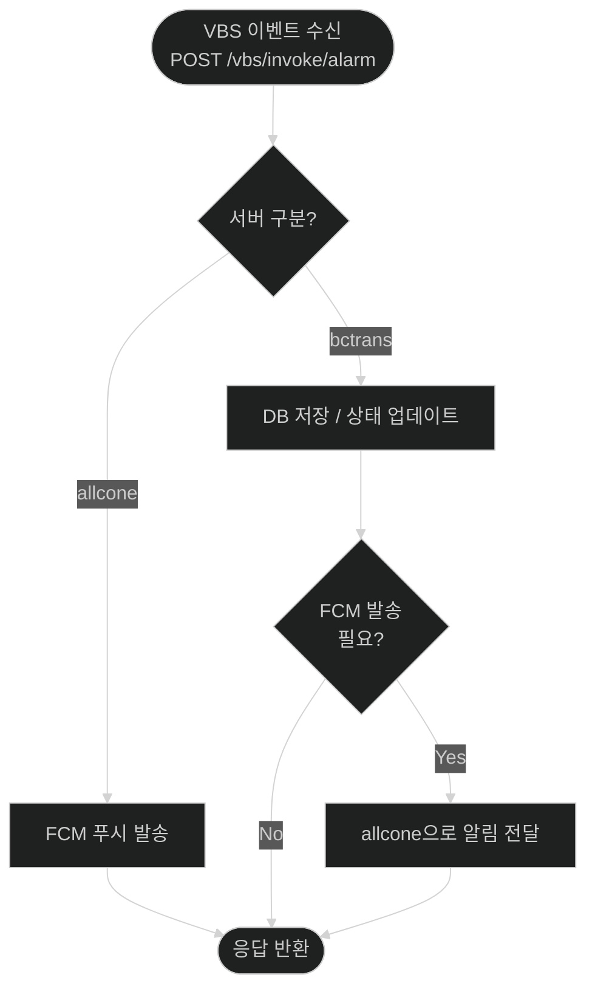
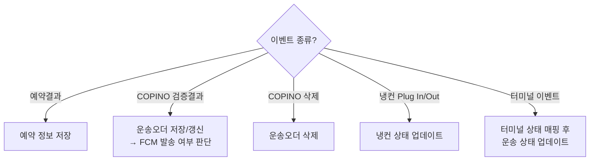
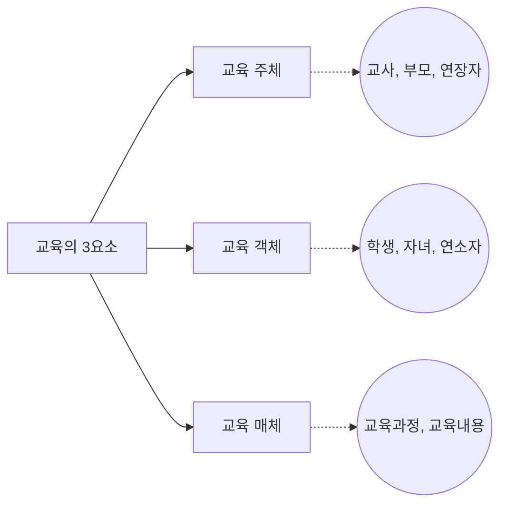

# 전송 직전 로그 포맷 대응표 (레거시 블록체인 vs 현재 카카오)

## 검색 키워드
- 레거시: `[BPA] [VBS] process.*SEND:`
- 현재: `_KAKAO_SEND`

## 대응표

| 이벤트                  | 레거시 (블록체인 전송전)                                                | 현재 (카카오 전송전)                        |
| -------------------- | ------------------------------------------------------------- | ----------------------------------- |
| GateIn               | `[BPA] [VBS] processGateIn SEND: {}`                          | `GATE_IN_KAKAO_SEND`                |
| GateOut              | `[BPA] [VBS] processGateOut SEND: {}`                         | `GATE_OUT_KAKAO_SEND`               |
| GateError            | `[BPA] [VBS] processGateIn/Out SEND: {}` (에러플래그 구분)           | `GATE_ERROR_KAKAO_SEND`             |
| CancelOut            | `[BPA] [VBS] processCancelGate SEND: {}`                      | `CancelOut_KAKAO_SEND`              |
| CopinoVerification   | `[BPA] [VBS] processCopinoVerification SEND: {}`              | `COPINO_VERIFICATION_KAKAO_SEND`    |
| CopinoDelete         | `[BPA] [VBS] processCopinoRemove SEND: {}`                    | `COPINO_DELETE_KAKAO_SEND`          |
| JobDone              | `[BPA] [VBS] processJobDone SEND: {}`                         | `JOB_DONE_KAKAO_SEND`               |
| EmptyConSwap         | `[BPA] [VBS] processEmptyConSwapResult SEND: {}`              | `emptyConSwap_KAKAO_SEND`           |
| EmptyConSwap M2Block | `[BPA] [VBS] AutoPickup processEmptyConSwapResult SEND: {}`   | `EMPTY_CON_SWAP_M2BLOCK_KAKAO_SEND` |
| NonLoc               | `[BPA] [VBS] processNonConLocation SEND: {}`                  | `NonLoc_KAKAO_SEND`                 |
| ChangeConLoc         | `[BPA] [VBS] processNonConLocation SEND: {}` (NonLoc과 동일 서비스) | `ChangeConLoc_KAKAO_SEND`           |
# 00. VBS Invoke Alarm - 공통 진입점

## 개요

터미널 시스템에서 VBS 이벤트 발생 시 `POST /vbs/invoke/alarm`으로 호출.
serverName에 따라 bctrans(DB 처리) → allcone(FCM 푸시) 순서로 분기.

## 진입 분기

```mermaid

---
config:
  theme: dark
---

flowchart TD
    START(["VBS 이벤트 수신
    POST /vbs/invoke/alarm"]) --> SERVER{"서버 구분?"}

    SERVER -->|"allcone"| AC["FCM 푸시 발송"]
    AC --> OK

    SERVER -->|"bctrans"| BC["DB 저장 / 상태 업데이트"]
    BC --> NEED{"FCM 발송
    필요?"}
    NEED -->|Yes| SEND["allcone으로 알림 전달"]
    NEED -->|No| OK
    SEND --> OK

    OK(["응답 반환"])
```

## 이벤트별 처리 분기

```mermaid

flowchart TD
    EVENT{"이벤트 종류?"}

    EVENT -->|"예약결과"| RSV["예약 정보 저장"]
    EVENT -->|"COPINO 검증결과"| CPV["운송오더 저장/갱신
    → FCM 발송 여부 판단"]
    EVENT -->|"COPINO 삭제"| RMV["운송오더 삭제"]
    EVENT -->|"냉컨 Plug In/Out"| RFR["냉컨 상태 업데이트"]
    EVENT -->|"터미널 이벤트"| TRM["터미널 상태 매핑 후
    운송 상태 업데이트"]
```

```mermaid
graph LR
	R[교육의 3요소] --> A[교육 주체] -.-> AA((교사, 부모, 연장자))
	R --> B[교육 객체] -.-> BB((학생, 자녀, 연소자))
	R --> C[교육 매체] -.-> CC((교육과정, 교육내용))
```
