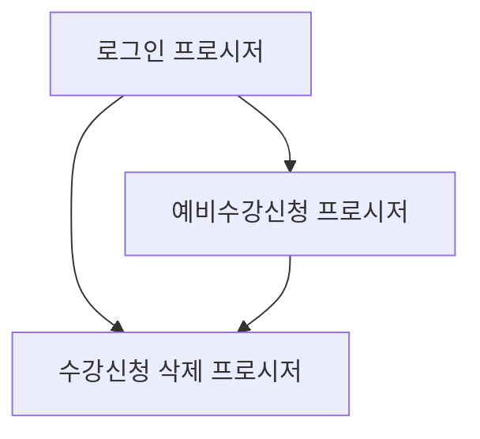

# 수강신청 시스템 프로시저 연결 구조

## 1. 프로시저 개요

### 1.1 로그인 프로시저
- 이름: `USP_SUKANG_LOGIN_SWIT`
- 목적: 사용자 인증 및 수강신청에 필요한 기본 정보 제공

### 1.2 예비수강신청 프로시저
- 이름: `USP_SUKANG_SIN_SWIT`
- 목적: 실제 수강신청 또는 예비수강신청 처리

### 1.3 수강신청 삭제 프로시저
- 이름: `USP_SUKANG_DEL`
- 목적: 수강신청 또는 예비수강신청 내역 삭제

## 2. 프로시저 간 연결 구조

## 3. 프로시저 호출 순서

1. `USP_SUKANG_LOGIN_SWIT` 호출
   - 사용자 인증
   - 학생 정보 및 수강 관련 기본 정보 조회

2. `USP_SUKANG_SIN_SWIT` 호출 (예비수강신청 시)
   - 로그인 프로시저에서 받은 정보 활용
   - 예비수강신청 처리

3. `USP_SUKANG_DEL` 호출 (필요 시)
   - 로그인 프로시저에서 받은 정보 활용
   - 예비수강신청 내역 삭제

## 4. 흐름(가안)

1. '예비수강신청장바구니 등록' 버튼 클릭시 로그인 프로시저 호출
2. 로그인 프로시저의 결과값을 변수에 저장 후 팝업창 열기
4. 예비수강신청 프로시저 호출
5. 삭제 프로시저 호출

## 상세 구조(가안)

1. \\\[AI시스템\]장바구니 화면에서 연계할 교과목을 체크
2. 로그인 프로시저를 호출 한 후 결과을 변수에 저장하고 팝업창 오픈
   - 왼쪽
     - 1.에서 선택한 교과목의 시간표 형태(or 리스트형태)
     - 버튼 추가
	     - 예비수강신청하기(=장바구니 담기)
	     - 
   - 오른쪽 : 예비수강신청 테이블 교과목의 시간표형태(or 리스트형태)

이러한 구조를 통해 사용자 인증부터 예비수강신청, 그리고 필요 시 삭제까지의 전체 프로세스가 연결되어 작동합니다. 각 단계에서 이전 단계의 결과를 활용하여 안전하고 일관된 수강신청 process를 제공합니다.