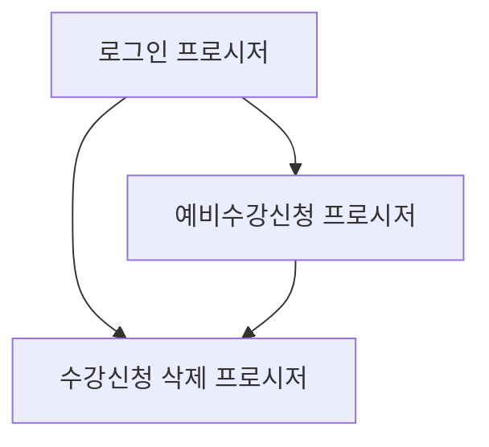

# 수강신청 시스템 프로시저 분석 및 호출 흐름(가안)

## 1. 프로시저 개요

### 1.1 로그인 프로시저
- 이름: `USP_SUKANG_LOGIN_SWIT`
- 목적: 사용자 인증 및 수강신청에 필요한 기본 정보 제공

### 1.2 예비수강신청 프로시저
- 이름: `USP_SUKANG_SIN_SWIT`
- 목적: 실제 수강신청 또는 예비수강신청 처리

### 1.3 수강신청 삭제 프로시저
- 이름: `USP_SUKANG_DEL`
- 목적: 수강신청 또는 예비수강신청 내역 삭제

### 1.4 참고
- 로그인 프로시저의 경우 학생의 패스워드를 알 수 없는 상태이기에 해결책을 생각해봐야함
	1. 관리자 권한으로 실행(s)

## 2. 프로시저 간 연결 구조

## 3. 프로시저 호출 순서

1. `USP_SUKANG_LOGIN_SWIT` 호출
	- 사용자 인증
	- 학생 정보 및 수강 관련 기본 정보 조회

2. `USP_SUKANG_SIN_SWIT` 호출 (예비수강신청 시)
	- 로그인 프로시저에서 받은 정보 활용
	- 예비수강신청 처리

3. `USP_SUKANG_DEL` 호출 (필요 시)
	- 로그인 프로시저에서 받은 정보 활용
	- 예비수강신청 내역 삭제

## 4. 흐름

1. '예비수강신청장바구니 등록' 버튼 클릭시 로그인 프로시저 호출
2. 로그인 프로시저의 결과값을 변수에 저장 후 팝업창 오픈
4. 예비수강신청 프로시저 호출
5. 삭제 프로시저 호출

## 5. 상세 구조

1. \\\[AI시스템\]장바구니 화면에서 연계할 교과목을 체크
2. 로그인 프로시저를 호출 한 후 결과을 변수에 저장하고 팝업창 오픈
	- 왼쪽
	     - 1.에서 선택한 교과목의 시간표 형태(or 리스트형태) 
	     - 체크박스(여러 교과목을 한번에 장바구니로 옮기때 필요 -  프로시저 루프호출이기 때문에 시스템 부하 가능성 있음)
	     - 버튼
		     - 예비수강신청하기(=장바구니 담기)
		     - (체크박스가 있을때) 전체선택
		     - (체크박스가 있을때) 전체선택 해제	       
	   - 오른쪽
		   - 예비수간신청 테이블 교과목의 시간표 형태(or 리스트형태)
		   - 체크박스(여러 교과목을 한번에 삭제할때 필요 -  프로시저 루프호출이기 때문에 시스템 부하 가능성 있음)
		   - 버튼
			   - 교과목삭제(=장바구니 삭제)
			   - (체크박스가 있을때) 전체선택
			   - (체크박스가 있을때) 전체선택 해제
3. (1.에서 )선택한 교과목을 예비수강신청(장바구니)에 담기
	- 왼쪽의 교과목은 그대로 유지
1. (필요 시) 예비수강신청(장바구니)의 선택한 교과목 삭제
	- 왼쪽의 교과목은 그대로 유지되어있기에 다시 넣을 수 있음

## 참고

1. 팝업 왼쪽 교과목의 시간중복선택 가능여부에 따라 시간표가 나을지 리스트가 나을지 정해야
	- 시간표에서 중복교과목에 대한 체크박스를 구현하는데 어려움이 있을 수 있음
2. 모두(오른쪽에) 담은 후 저장버튼 클릭시 프로시저를 루프호출하는 방법도 있음
	- 해당 부분은 부하여부와 구현난이도를 생각해야함
	- 수강신청서비스와 동시 이용 시 꼬이게 될 수도 있음
	  (예: 수강신청서비스에서 교과목 삭제/등록 시 미리 켜놓은 AI서비스의 팝업창 오른쪽 교과목은 변화가 없음)