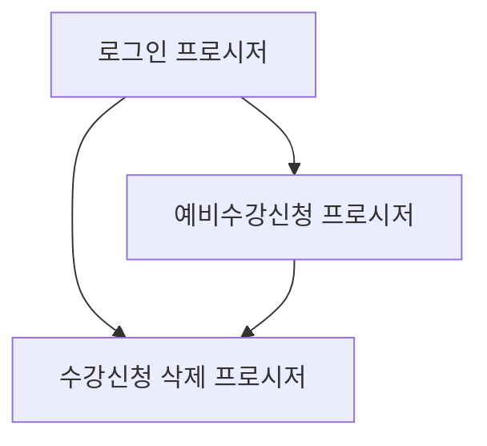

# 수강신청 시스템 프로시저 연결 구조

## 1. 프로시저 개요

### 1.1 로그인 프로시저
- 이름: `USP_SUKANG_LOGIN_SWIT`
- 목적: 사용자 인증 및 수강신청에 필요한 기본 정보 제공

### 1.2 예비수강신청 프로시저
- 이름: `USP_SUKANG_SIN_SWIT`
- 목적: 실제 수강신청 또는 예비수강신청 처리

### 1.3 수강신청 삭제 프로시저
- 이름: `USP_SUKANG_DEL`
- 목적: 수강신청 또는 예비수강신청 내역 삭제

## 2. 프로시저 간 연결 구조

## 3. 프로시저 호출 순서

1. `USP_SUKANG_LOGIN_SWIT` 호출
   - 사용자 인증
   - 학생 정보 및 수강 관련 기본 정보 조회

2. `USP_SUKANG_SIN_SWIT` 호출 (예비수강신청 시)
   - 로그인 프로시저에서 받은 정보 활용
   - 예비수강신청 처리

3. `USP_SUKANG_DEL` 호출 (필요 시)
   - 로그인 프로시저에서 받은 정보 활용
   - 예비수강신청 내역 삭제

## 4. 주요 연결 포인트

### 4.1 로그인 프로시저 → 예비수강신청 프로시저
- 학생 기본 정보 (학번, 학과, 학년 등)
- 수강 가능 학점
- 수강신청 기간 정보
- 세션 토큰 (보안용)

### 4.2 로그인 프로시저 → 수강신청 삭제 프로시저
- 학생 기본 정보
- 세션 토큰

### 4.3 예비수강신청 프로시저 → 수강신청 삭제 프로시저
- 직접적인 데이터 전달은 없음
- 동일한 학생 정보와 세션 정보 사용

## 5. 데이터 흐름

1. 로그인 프로시저에서 학생 정보와 권한 확인
2. 확인된 정보를 바탕으로 예비수강신청 프로시저 호출
3. 예비수강신청 결과에 따라 필요 시 삭제 프로시저 호출

이러한 구조를 통해 사용자 인증부터 예비수강신청, 그리고 필요 시 삭제까지의 전체 프로세스가 연결되어 작동합니다. 각 단계에서 이전 단계의 결과를 활용하여 안전하고 일관된 수강신청 process를 제공합니다.